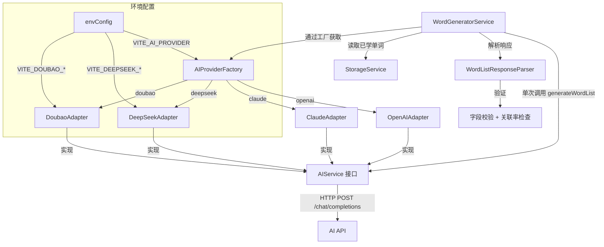

# 技术设计文档：AI 单词生成功能

## 概述

本文档描述将 `WordGeneratorService` 从硬编码 mock 实现升级为真实 AI API 调用的技术设计。核心目标是新增 DeepSeek 和豆包（Doubao）两个 AI 适配器，并重构 `WordGeneratorService` 以通过单次 AI 调用生成完整的每日学习内容（单词列表、语义关联、句子链）。

### 设计目标

- **最小侵入**：复用现有 `OpenAIAdapter` 的架构模式，新适配器与现有代码保持一致的风格
- **单次调用**：所有内容（单词、关联、句子链）在一次 AI API 调用中生成，降低延迟和成本
- **健壮解析**：容忍 AI 输出的轻微格式偏差，减少因 AI 不稳定导致的失败
- **清晰错误**：所有失败路径都有明确的错误类型和信息，便于用户和开发者诊断

### 研究摘要

**DeepSeek API**：兼容 OpenAI chat completions 格式，端点为 `{apiUrl}/chat/completions`，使用 `Authorization: Bearer {apiKey}` 认证。默认模型 `deepseek-chat`，默认 URL `https://api.deepseek.com`。

**豆包（Doubao）API**：同样兼容 OpenAI chat completions 格式，端点为 `{apiUrl}/chat/completions`，使用相同的 Bearer Token 认证。默认模型 `doubao-pro-4k`，默认 URL `https://ark.cn-beijing.volces.com/api/v3`。

两者均与 `OpenAIAdapter` 的请求/响应格式完全兼容，因此适配器实现可以直接复用 `OpenAIAdapter` 的 HTTP 调用逻辑，仅需调整配置参数和提供商标识。

---

## 架构

### 整体架构图



### 关键设计决策

**决策 1：单次 AI 调用生成所有内容**

需求要求单词、关联、句子链在一次 Prompt 中生成。这意味着 `WordGeneratorService` 不再调用 `AIService.generateExamples()` 和 `AIService.generateSentenceChains()`，而是直接调用一个新的 `generateWordList()` 方法（或通过 `generateExamples` 传递扩展 Prompt）。

考虑到现有 `AIService` 接口已有 `generateExamples` 和 `generateSentenceChains`，为避免破坏现有代码，新增一个专用方法 `generateWordList()` 到 `AIService` 接口，各适配器实现该方法。

**决策 2：DeepSeek 和豆包适配器复用 OpenAI 兼容逻辑**

由于两者均兼容 OpenAI chat completions 格式，适配器实现与 `OpenAIAdapter` 几乎相同，仅 provider 名称、默认配置和日志前缀不同。为避免代码重复，提取一个 `OpenAICompatibleAdapter` 基类，`DeepSeekAdapter`、`DoubaoAdapter` 和 `OpenAIAdapter` 均继承自它。

**决策 3：解析逻辑独立为 `WordListResponseParser`**

将 AI 响应解析（Markdown 代码块提取、JSON 提取、字段校验）独立为一个纯函数模块，便于单独测试和复用。

---

## 组件与接口

### 新增组件

#### 1. `DeepSeekAdapter`

路径：`src/services/ai/DeepSeekAdapter.ts`

继承 `OpenAICompatibleAdapter`，使用 DeepSeek 配置。

```typescript
export class DeepSeekAdapter extends OpenAICompatibleAdapter {
  constructor(config: AIServiceConfig) {
    super(config, 'deepseek');
  }
}
```

#### 2. `DoubaoAdapter`

路径：`src/services/ai/DoubaoAdapter.ts`

继承 `OpenAICompatibleAdapter`，使用豆包配置。

```typescript
export class DoubaoAdapter extends OpenAICompatibleAdapter {
  constructor(config: AIServiceConfig) {
    super(config, 'doubao');
  }
}
```

#### 3. `OpenAICompatibleAdapter`（基类）

路径：`src/services/ai/OpenAICompatibleAdapter.ts`

提取 `OpenAIAdapter` 中的通用逻辑，支持所有 OpenAI 兼容格式的 API。

```typescript
export abstract class OpenAICompatibleAdapter implements AIService {
  protected config: AIServiceConfig;
  protected providerName: string;

  constructor(config: AIServiceConfig, providerName: string) { ... }

  async generateExamples(request: AIGenerationRequest): Promise<AIGenerationResponse> { ... }
  async generateSentenceChains(...): Promise<...> { ... }
  async generateWordList(request: WordListGenerationRequest): Promise<WordListGenerationResponse> { ... }
  async validateConnection(): Promise<boolean> { ... }
}
```

#### 4. `WordListResponseParser`

路径：`src/services/ai/WordListResponseParser.ts`

纯函数模块，负责解析 AI 返回的单词列表响应。

```typescript
export interface RawWordData {
  word: string;
  phonetic?: string;
  definitions: Array<{ partOfSpeech: string; meaningCN: string; meaningEN: string }>;
  examples: Array<{ sentence: string; translation: string; highlightWord: string }>;
}

export interface RawAssociationData {
  word1: string;
  word2: string;
  associationType: string;
  description: string;
}

export interface RawSentenceChainData {
  sentence: string;
  translation: string;
  usedWords: string[];
}

export interface RawWordListResponse {
  words: RawWordData[];
  associations: RawAssociationData[];
  sentenceChains: RawSentenceChainData[];
}

/**
 * 从 AI 响应文本中提取并解析 JSON
 * 支持 Markdown 代码块和额外文本包裹
 */
export function extractJSON(content: string): unknown { ... }

/**
 * 校验并过滤单词数组，丢弃缺少必要字段的条目
 */
export function validateAndFilterWords(raw: unknown[]): RawWordData[] { ... }

/**
 * 修正非法的 associationType 为 'semantic'
 */
export function normalizeAssociationType(type: string): AssociationType { ... }

/**
 * 将文本关联转换为基于 word.id 的 WordAssociation 对象
 */
export function resolveAssociationIds(
  rawAssociations: RawAssociationData[],
  words: Word[]
): WordAssociation[] { ... }

/**
 * 过滤句子链中不在当日单词列表中的 usedWords
 */
export function filterValidSentenceChainWords(
  chains: RawSentenceChainData[],
  words: Word[]
): SentenceChain[] { ... }
```

#### 5. `AIProviderFactory`（更新）

路径：`src/services/ai/AIProviderFactory.ts`（新文件，或更新 `index.ts`）

```typescript
export type SupportedProvider = 'openai' | 'claude' | 'deepseek' | 'doubao';

export function createAIProvider(provider: string, config: EnvConfig): AIService {
  switch (provider) {
    case 'openai':  return new OpenAIAdapter({ ... });
    case 'claude':  return new ClaudeAdapter({ ... });
    case 'deepseek': return new DeepSeekAdapter({ ... });
    case 'doubao':  return new DoubaoAdapter({ ... });
    default:
      throw new Error(
        `不支持的 AI 提供商: "${provider}"。支持的提供商: openai, claude, deepseek, doubao`
      );
  }
}
```

### 修改的组件

#### `AIService` 接口（扩展）

在 `src/services/ai/types.ts` 中新增 `generateWordList` 方法：

```typescript
export interface WordListGenerationRequest {
  count: number;
  usedWords: string[];
  theme?: string;
  difficulty?: string;
}

export interface WordListGenerationResponse {
  words: RawWordData[];
  associations: RawAssociationData[];
  sentenceChains: RawSentenceChainData[];
  metadata: {
    model: string;
    tokensUsed: number;
    generationTime: number;
  };
}

export interface AIService {
  generateExamples(request: AIGenerationRequest): Promise<AIGenerationResponse>;
  generateSentenceChains(...): Promise<...>;
  generateWordList(request: WordListGenerationRequest): Promise<WordListGenerationResponse>; // 新增
  validateConnection(): Promise<boolean>;
}
```

#### `WordGeneratorServiceImpl`（重构）

路径：`src/services/WordGeneratorService.ts`

核心变化：
- 通过 `AIProviderFactory` 获取 AI 适配器（不再直接实例化）
- `generateDailyWords` 调用 `aiService.generateWordList()` 替代 mock 逻辑
- 使用 `WordListResponseParser` 解析和验证响应
- 保留现有的关联率检查和句子链数量检查逻辑

---

## 数据模型

### Prompt 结构（单次调用）

`WordGeneratorService` 向 AI 发送的 Prompt 要求 AI 返回如下 JSON 结构：

```json
{
  "words": [
    {
      "word": "resilience",
      "phonetic": "/rɪˈzɪliəns/",
      "definitions": [
        {
          "partOfSpeech": "noun",
          "meaningCN": "韧性；恢复力",
          "meaningEN": "The capacity to recover quickly from difficulties"
        }
      ],
      "examples": [
        {
          "sentence": "Her resilience in the face of adversity inspired everyone around her.",
          "translation": "她面对逆境时展现出的韧性激励了周围所有人。",
          "highlightWord": "resilience"
        },
        {
          "sentence": "Building resilience is key to long-term mental health.",
          "translation": "培养韧性是长期心理健康的关键。",
          "highlightWord": "resilience"
        }
      ]
    }
  ],
  "associations": [
    {
      "word1": "resilience",
      "word2": "perseverance",
      "associationType": "semantic",
      "description": "Both describe mental strength in overcoming challenges"
    }
  ],
  "sentenceChains": [
    {
      "sentence": "Her resilience and perseverance helped her overcome every obstacle.",
      "translation": "她的韧性和毅力帮助她克服了每一个障碍。",
      "usedWords": ["resilience", "perseverance"]
    }
  ]
}
```

### 环境变量（新增）

| 变量名 | 说明 | 默认值 |
|--------|------|--------|
| `VITE_DEEPSEEK_API_KEY` | DeepSeek API 密钥 | — |
| `VITE_DEEPSEEK_MODEL` | DeepSeek 模型名称 | `deepseek-chat` |
| `VITE_DEEPSEEK_API_URL` | DeepSeek API 基础 URL | `https://api.deepseek.com` |
| `VITE_DOUBAO_API_KEY` | 豆包 API 密钥 | — |
| `VITE_DOUBAO_MODEL` | 豆包模型名称 | `doubao-pro-4k` |
| `VITE_DOUBAO_API_URL` | 豆包 API 基础 URL | `https://ark.cn-beijing.volces.com/api/v3` |

> 注：`envConfig.ts` 已包含上述变量的读取逻辑，无需修改。

---

## 正确性属性

*属性是在系统所有有效执行中都应成立的特征或行为——本质上是关于系统应该做什么的形式化陈述。属性是人类可读规范与机器可验证正确性保证之间的桥梁。*

### 属性 1：HTTP 错误状态码映射到 AIServiceError

*对于任意* 4xx 或 5xx HTTP 状态码，当 DeepSeek 或豆包适配器收到该错误响应时，应抛出包含正确 `provider` 名称、`statusCode` 和原始错误信息的 `AIServiceError`。

**验证：需求 1.4、2.4**

### 属性 2：Prompt 始终包含必要的生成要求

*对于任意* 合法的 `count`、`planId` 和 `usedWords` 列表，`WordGeneratorService` 发送给 AI 的 Prompt 应始终包含：音标（IPA）要求、中英文释义要求、例句要求、JSON 格式要求，以及 `usedWords` 中的所有单词（要求 AI 不重复）。

**验证：需求 3.1、3.2、3.5**

### 属性 3：无效单词字段过滤

*对于任意* 包含若干单词对象的 AI 响应数组（其中部分对象缺少 `word`、`definitions` 或 `examples` 字段），解析后的结果应只包含字段完整的单词对象，且不包含任何字段不完整的对象。

**验证：需求 3.3、8.3**

### 属性 4：非法 associationType 修正为 semantic

*对于任意* 不属于 `theme | semantic | root | context` 枚举的 `associationType` 字符串，`normalizeAssociationType` 函数应将其修正为 `semantic`。

**验证：需求 4.2**

### 属性 5：文本关联到 ID 关联的转换正确性

*对于任意* 单词列表和文本关联数组，`resolveAssociationIds` 转换后的每个 `WordAssociation` 对象中，`word1Id` 和 `word2Id` 应分别对应原始文本关联中 `word1` 和 `word2` 所指向的单词的 `id`。

**验证：需求 4.3**

### 属性 6：低关联率触发 GenerationError

*对于任意* 关联率（已关联单词对数 / 总单词对数）严格小于 0.8 的单词列表和关联数组，`generateDailyWords` 应抛出消息为"生成的单词关联性不足"的 `GenerationError`。

**验证：需求 4.4**

### 属性 7：句子链无效单词过滤

*对于任意* 当日单词列表和句子链数组（其中部分句子链的 `usedWords` 包含不在当日单词列表中的单词），过滤后每条句子链的 `usedWordIds` 应只包含当日单词列表中存在的单词 ID。

**验证：需求 5.3**

### 属性 8：句子链数量不足触发 GenerationError

*对于任意* 有效句子链数量严格小于 3 的 AI 响应，`generateDailyWords` 应抛出消息为"生成的句子链数量不足"的 `GenerationError`。

**验证：需求 5.4**

### 属性 9：工厂函数对合法 provider 返回正确适配器类型

*对于任意* 属于 `['openai', 'claude', 'deepseek', 'doubao']` 的 provider 字符串，`createAIProvider` 应返回对应类型的适配器实例（分别为 `OpenAIAdapter`、`ClaudeAdapter`、`DeepSeekAdapter`、`DoubaoAdapter`）。

**验证：需求 6.1、6.2、6.3**

### 属性 10：工厂函数对非法 provider 抛出包含支持列表的错误

*对于任意* 不属于支持列表的 provider 字符串，`createAIProvider` 应抛出错误，且错误信息中包含所有支持的提供商名称（openai、claude、deepseek、doubao）。

**验证：需求 6.5**

### 属性 11：AI 响应 JSON 提取的健壮性（往返属性）

*对于任意* 合法的 `RawWordListResponse` JSON 对象，将其序列化为字符串（可选地包裹在 Markdown 代码块或额外文本中），再通过 `extractJSON` 解析，应得到与原始对象语义等价的结果。

**验证：需求 8.1、8.2、8.4**

---

## 错误处理

### 错误分类与处理策略

| 错误场景 | 错误类型 | 处理方式 |
|---------|---------|---------|
| AI API 网络错误/超时 | `NetworkError` → 重试 | `RetryHandler` 最多 3 次，指数退避 |
| 所有重试失败 | `GenerationError` | 包含提供商名称和最后一次失败原因 |
| AI 返回 JSON 无法解析 | `GenerationError` | 消息："AI 返回数据格式无效" |
| 关联率 < 80% | `GenerationError` | 消息："生成的单词关联性不足" |
| 有效句子链 < 3 条 | `GenerationError` | 消息："生成的句子链数量不足" |
| 不支持的 AI 提供商 | `Error` | 包含支持的提供商列表 |
| AI 返回 HTTP 4xx/5xx | `AIServiceError` | 包含 provider、statusCode、原始错误 |

### 错误传播链

```
AI API 调用失败
  └─ httpClient 抛出 NetworkError
       └─ RetryHandler 捕获，重试最多 3 次
            └─ 重试耗尽 → RetryExhaustedError
                 └─ WordGeneratorService 捕获
                      └─ 抛出 GenerationError（包含提供商名称和原因）
```

### 降级策略

本功能**不提供 mock 降级**（需求 3.4 明确要求不补充 mock 数据）。当 AI 服务不可用时，`generateDailyWords` 抛出 `GenerationError`，由上层（`useDailyWords` hook）捕获并向用户展示错误信息。

---

## 测试策略

### 测试框架

- **单元测试 / 属性测试**：Vitest + fast-check（项目已安装 `fast-check@^3.23.1`）
- **最小迭代次数**：每个属性测试运行 100 次

### 属性测试配置

每个属性测试使用以下标签格式注释：

```typescript
// Feature: ai-word-generation, Property N: <属性描述>
```

### 测试文件规划

| 文件 | 测试内容 |
|------|---------|
| `src/services/ai/DeepSeekAdapter.test.ts` | 适配器接口实现、HTTP 请求格式、错误处理（属性 1） |
| `src/services/ai/DoubaoAdapter.test.ts` | 适配器接口实现、HTTP 请求格式、错误处理（属性 1） |
| `src/services/ai/AIProviderFactory.test.ts` | 工厂路由逻辑（属性 9、10） |
| `src/services/ai/WordListResponseParser.test.ts` | JSON 提取、字段校验、关联修正、ID 转换（属性 3、4、5、11） |
| `src/services/WordGeneratorService.ai.test.ts` | 集成测试：完整生成流程（属性 2、6、7、8） |

### 属性测试示例

```typescript
// Feature: ai-word-generation, Property 1: HTTP 错误状态码映射到 AIServiceError
it('对任意 4xx/5xx 状态码，适配器应抛出包含正确信息的 AIServiceError', () => {
  fc.assert(
    fc.asyncProperty(
      fc.integer({ min: 400, max: 599 }),
      fc.constantFrom('deepseek', 'doubao'),
      async (statusCode, provider) => {
        // mock httpClient 返回对应状态码的错误
        // 验证抛出的 AIServiceError.provider === provider
        // 验证 AIServiceError.statusCode === statusCode
      }
    ),
    { numRuns: 100 }
  );
});

// Feature: ai-word-generation, Property 3: 无效单词字段过滤
it('对任意包含无效单词的数组，解析后只保留字段完整的单词', () => {
  fc.assert(
    fc.property(
      fc.array(fc.record({
        word: fc.option(fc.string({ minLength: 1 })),
        definitions: fc.option(fc.array(fc.record({...}), { minLength: 1 })),
        examples: fc.option(fc.array(fc.record({...}), { minLength: 1 })),
      })),
      (rawWords) => {
        const result = validateAndFilterWords(rawWords);
        // 所有结果都有完整字段
        return result.every(w => w.word && w.definitions.length > 0 && w.examples.length > 0);
      }
    ),
    { numRuns: 100 }
  );
});
```

### 单元测试覆盖

- **DeepSeekAdapter / DoubaoAdapter**：
  - `validateConnection` 发送 `max_tokens: 1` 的请求
  - API 成功时返回正确的响应结构
  - API 失败时抛出 `AIServiceError`（含 provider 名称）

- **AIProviderFactory**：
  - 每个合法 provider 返回正确的适配器类型
  - 非法 provider 抛出包含支持列表的错误

- **WordGeneratorService**（集成）：
  - mock AI 服务，验证 Prompt 包含必要内容
  - mock AI 返回少于请求数量的单词，验证返回实际数量
  - mock AI 返回关联率不足的数据，验证抛出 `GenerationError`
  - mock AI 返回少于 3 条句子链，验证抛出 `GenerationError`
  - mock AI 返回无效 JSON，验证抛出 `GenerationError`
