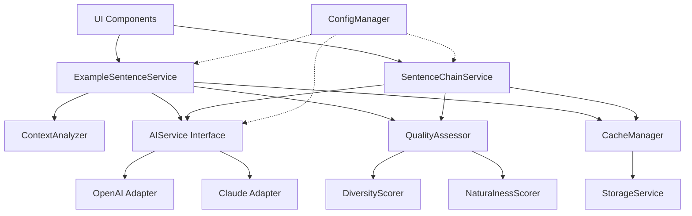
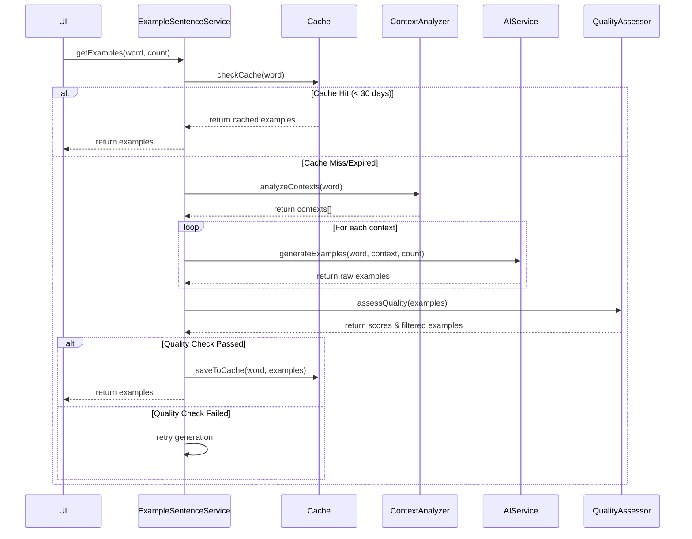

# 设计文档：增强例句和连锁句功能

## Overview

This design document describes the technical architecture for enhancing the example sentence and sentence chain generation system in the vocabulary learning application. The current system uses fixed templates to generate example sentences, resulting in monotonous and unnatural content. The enhanced system will integrate AI services (OpenAI/Claude) to generate contextual, diverse, and natural example sentences across multiple application scenarios.

### Key Design Goals

1. **Scenario-based Generation**: Identify and generate examples for different application contexts (daily conversation, business, academic, technical, literary)
2. **Natural Language Quality**: Eliminate template-based generation in favor of AI-generated natural sentences
3. **Diversity and Quality Control**: Implement scoring systems to ensure variety and naturalness
4. **Performance Optimization**: Cache generated content to minimize API calls and improve response times
5. **Extensibility**: Design plugin-based architecture for custom analyzers and quality assessors

### Architecture Overview



## Architecture

### System Components

The enhanced example sentence system consists of the following major components:

1. **AIService Interface & Adapters**: Abstract interface for AI providers with concrete implementations for OpenAI and Claude
2. **ContextAnalyzer**: Analyzes words to identify applicable scenarios (daily, business, academic, technical, literary)
3. **Enhanced ExampleSentenceService**: Orchestrates example generation with quality control
4. **Enhanced SentenceChainService**: Generates multi-word sentences with scenario awareness
5. **QualityAssessor**: Evaluates diversity and naturalness of generated content
6. **CacheManager**: Manages persistent caching of generated examples
7. **ConfigManager**: Centralized configuration management with validation
8. **UI Components**: Updated ExampleSentences and SentenceChainSection components

### Component Interaction Flow



## Components and Interfaces

### 1. AIService Interface

The AIService interface provides an abstraction layer for different AI providers, enabling easy switching between OpenAI and Claude.

#### Interface Definition

```typescript
export interface AIServiceConfig {
  apiKey: string;
  model: string;
  apiUrl: string;
  maxRetries: number;
  timeout: number;
}

export interface AIGenerationRequest {
  word: string;
  context: ApplicationContext;
  count: number;
  constraints?: {
    minLength?: number;
    maxLength?: number;
    avoidPatterns?: string[];
  };
}

export interface AIGenerationResponse {
  examples: ExampleSentence[];
  metadata: {
    model: string;
    tokensUsed: number;
    generationTime: number;
  };
}

export interface AIService {
  /**
   * Generate example sentences for a word in a specific context
   */
  generateExamples(request: AIGenerationRequest): Promise<AIGenerationResponse>;
  
  /**
   * Generate sentence chains using multiple words
   */
  generateSentenceChains(
    words: string[],
    context: ApplicationContext,
    count: number
  ): Promise<SentenceChain[]>;
  
  /**
   * Validate service configuration and connectivity
   */
  validateConnection(): Promise<boolean>;
}
```

#### OpenAI Adapter Implementation

```typescript
export class OpenAIAdapter implements AIService {
  private config: AIServiceConfig;
  private httpClient: HttpClient;
  
  constructor(config: AIServiceConfig) {
    this.config = config;
    this.httpClient = new HttpClient({
      baseURL: config.apiUrl,
      timeout: config.timeout,
      headers: {
        'Authorization': `Bearer ${config.apiKey}`,
        'Content-Type': 'application/json',
      },
    });
  }
  
  async generateExamples(request: AIGenerationRequest): Promise<AIGenerationResponse> {
    const prompt = this.buildExamplePrompt(request);
    const startTime = Date.now();
    
    try {
      const response = await this.httpClient.post('/chat/completions', {
        model: this.config.model,
        messages: [
          {
            role: 'system',
            content: 'You are an expert English teacher creating natural, diverse example sentences for vocabulary learning.',
          },
          {
            role: 'user',
            content: prompt,
          },
        ],
        temperature: 0.8, // Higher temperature for diversity
        max_tokens: 2000,
      });
      
      const examples = this.parseExamplesFromResponse(response.data);
      
      return {
        examples,
        metadata: {
          model: this.config.model,
          tokensUsed: response.data.usage.total_tokens,
          generationTime: Date.now() - startTime,
        },
      };
    } catch (error) {
      throw new NetworkError(`OpenAI API call failed: ${error.message}`);
    }
  }
  
  private buildExamplePrompt(request: AIGenerationRequest): string {
    const { word, context, count, constraints } = request;
    
    return `Generate ${count} natural, diverse example sentences for the word "${word}" in the context of ${context}.

Requirements:
- Each sentence should be natural and idiomatic, as a native speaker would say it
- Vary sentence structure, length, and complexity
- Include sentences between ${constraints?.minLength || 8} and ${constraints?.maxLength || 20} words
- Avoid repetitive sentence patterns
- Ensure the word "${word}" appears in each sentence
- Provide Chinese translation for each sentence

Format your response as JSON:
[
  {
    "sentence": "English sentence here",
    "translation": "中文翻译",
    "highlightWord": "${word}"
  },
  ...
]`;
  }
  
  private parseExamplesFromResponse(data: any): ExampleSentence[] {
    const content = data.choices[0].message.content;
    const jsonMatch = content.match(/\[[\s\S]*\]/);
    
    if (!jsonMatch) {
      throw new Error('Failed to parse examples from AI response');
    }
    
    return JSON.parse(jsonMatch[0]);
  }
  
  async generateSentenceChains(
    words: string[],
    context: ApplicationContext,
    count: number
  ): Promise<SentenceChain[]> {
    // Similar implementation for sentence chains
    // ... (implementation details)
  }
  
  async validateConnection(): Promise<boolean> {
    try {
      await this.httpClient.get('/models');
      return true;
    } catch {
      return false;
    }
  }
}
```

#### Claude Adapter Implementation

```typescript
export class ClaudeAdapter implements AIService {
  private config: AIServiceConfig;
  private httpClient: HttpClient;
  
  constructor(config: AIServiceConfig) {
    this.config = config;
    this.httpClient = new HttpClient({
      baseURL: config.apiUrl,
      timeout: config.timeout,
      headers: {
        'x-api-key': config.apiKey,
        'anthropic-version': '2023-06-01',
        'Content-Type': 'application/json',
      },
    });
  }
  
  async generateExamples(request: AIGenerationRequest): Promise<AIGenerationResponse> {
    const prompt = this.buildExamplePrompt(request);
    const startTime = Date.now();
    
    try {
      const response = await this.httpClient.post('/messages', {
        model: this.config.model,
        max_tokens: 2000,
        temperature: 0.8,
        messages: [
          {
            role: 'user',
            content: prompt,
          },
        ],
      });
      
      const examples = this.parseExamplesFromResponse(response.data);
      
      return {
        examples,
        metadata: {
          model: this.config.model,
          tokensUsed: response.data.usage.input_tokens + response.data.usage.output_tokens,
          generationTime: Date.now() - startTime,
        },
      };
    } catch (error) {
      throw new NetworkError(`Claude API call failed: ${error.message}`);
    }
  }
  
  private buildExamplePrompt(request: AIGenerationRequest): string {
    // Similar to OpenAI but adapted for Claude's format
    // ... (implementation details)
  }
  
  private parseExamplesFromResponse(data: any): ExampleSentence[] {
    const content = data.content[0].text;
    const jsonMatch = content.match(/\[[\s\S]*\]/);
    
    if (!jsonMatch) {
      throw new Error('Failed to parse examples from AI response');
    }
    
    return JSON.parse(jsonMatch[0]);
  }
  
  async generateSentenceChains(
    words: string[],
    context: ApplicationContext,
    count: number
  ): Promise<SentenceChain[]> {
    // Similar implementation for sentence chains
    // ... (implementation details)
  }
  
  async validateConnection(): Promise<boolean> {
    try {
      // Claude doesn't have a simple health check endpoint
      // We can make a minimal request to verify connectivity
      await this.httpClient.post('/messages', {
        model: this.config.model,
        max_tokens: 10,
        messages: [{ role: 'user', content: 'test' }],
      });
      return true;
    } catch {
      return false;
    }
  }
}
```

### 2. ContextAnalyzer

The ContextAnalyzer identifies applicable scenarios for a given word based on its characteristics and common usage patterns.

#### Interface and Implementation

```typescript
export type ApplicationContext = 
  | 'daily-conversation'
  | 'business-communication'
  | 'academic-writing'
  | 'technical-documentation'
  | 'literary-expression';

export interface ContextAnalysisResult {
  contexts: ApplicationContext[];
  confidence: Record<ApplicationContext, number>;
  primaryContext: ApplicationContext;
}

export interface ContextAnalyzer {
  /**
   * Analyze a word to identify applicable contexts
   */
  analyzeContexts(word: string): Promise<ContextAnalysisResult>;
}

export class ContextAnalyzerImpl implements ContextAnalyzer {
  private aiService: AIService;
  
  // Keyword patterns for context identification
  private contextPatterns: Record<ApplicationContext, string[]> = {
    'daily-conversation': ['everyday', 'common', 'casual', 'informal', 'spoken'],
    'business-communication': ['professional', 'corporate', 'formal', 'business', 'workplace'],
    'academic-writing': ['scholarly', 'research', 'academic', 'theoretical', 'analytical'],
    'technical-documentation': ['technical', 'specialized', 'engineering', 'scientific', 'programming'],
    'literary-expression': ['literary', 'poetic', 'creative', 'artistic', 'expressive'],
  };
  
  constructor(aiService: AIService) {
    this.aiService = aiService;
  }
  
  async analyzeContexts(word: string): Promise<ContextAnalysisResult> {
    // Use AI to analyze the word's typical usage contexts
    const prompt = `Analyze the word "${word}" and identify which of these contexts it is commonly used in:
    1. Daily conversation (everyday informal speech)
    2. Business communication (professional workplace settings)
    3. Academic writing (scholarly and research contexts)
    4. Technical documentation (specialized technical fields)
    5. Literary expression (creative and artistic writing)
    
    For each context, provide a confidence score (0-1) indicating how commonly the word is used in that context.
    Return your analysis as JSON:
    {
      "contexts": ["context1", "context2"],
      "confidence": {
        "daily-conversation": 0.8,
        "business-communication": 0.6,
        ...
      },
      "primaryContext": "daily-conversation"
    }`;
    
    try {
      // Call AI service for context analysis
      const response = await this.aiService.generateExamples({
        word,
        context: 'daily-conversation', // Placeholder
        count: 1,
      });
      
      // Parse and validate the response
      // ... (parsing logic)
      
      // Return contexts with confidence > 0.5
      const contexts = Object.entries(confidence)
        .filter(([_, score]) => score > 0.5)
        .map(([context, _]) => context as ApplicationContext);
      
      return {
        contexts,
        confidence,
        primaryContext: contexts[0] || 'daily-conversation',
      };
    } catch (error) {
      // Fallback to heuristic-based analysis
      return this.heuristicAnalysis(word);
    }
  }
  
  private heuristicAnalysis(word: string): ContextAnalysisResult {
    // Simple heuristic: most words are suitable for daily conversation
    // Technical/specialized words might be identified by length or complexity
    const wordLength = word.length;
    const hasSpecializedSuffix = /tion|ment|ness|ity|ism|ology|graphy/.test(word);
    
    const contexts: ApplicationContext[] = ['daily-conversation'];
    const confidence: Record<ApplicationContext, number> = {
      'daily-conversation': 0.8,
      'business-communication': 0.5,
      'academic-writing': hasSpecializedSuffix ? 0.6 : 0.3,
      'technical-documentation': hasSpecializedSuffix ? 0.5 : 0.2,
      'literary-expression': 0.4,
    };
    
    // Add contexts with confidence > 0.5
    Object.entries(confidence).forEach(([context, score]) => {
      if (score > 0.5 && context !== 'daily-conversation') {
        contexts.push(context as ApplicationContext);
      }
    });
    
    return {
      contexts,
      confidence,
      primaryContext: 'daily-conversation',
    };
  }
}
```

### 3. Enhanced ExampleSentenceService

The enhanced ExampleSentenceService orchestrates the entire example generation process with quality control.

#### Updated Interface

```typescript
export interface EnhancedExampleSentence extends ExampleSentence {
  context: ApplicationContext;
  diversityScore?: number;
  naturalnessScore?: number;
  metadata: {
    generatedAt: Date;
    model: string;
    tokensUsed: number;
  };
}

export interface ExampleGenerationOptions {
  count: number;
  contexts?: ApplicationContext[];
  minQualityScore?: number;
  maxRetries?: number;
}

export interface ExampleGenerationResult {
  examples: EnhancedExampleSentence[];
  statistics: {
    totalGenerated: number;
    filtered: number;
    averageDiversityScore: number;
    averageNaturalnessScore: number;
    generationTime: number;
  };
}

export interface EnhancedExampleSentenceService extends ExampleSentenceService {
  /**
   * Generate examples with quality control
   */
  generateEnhancedExamples(
    word: string,
    options: ExampleGenerationOptions
  ): Promise<ExampleGenerationResult>;
  
  /**
   * Get examples from cache or generate new ones
   */
  getExamplesWithCache(
    word: string,
    count: number
  ): Promise<EnhancedExampleSentence[]>;
}
```

#### Implementation

```typescript
export class EnhancedExampleSentenceServiceImpl implements EnhancedExampleSentenceService {
  private aiService: AIService;
  private contextAnalyzer: ContextAnalyzer;
  private qualityAssessor: QualityAssessor;
  private cacheManager: CacheManager;
  private config: ExampleServiceConfig;
  
  constructor(
    aiService: AIService,
    contextAnalyzer: ContextAnalyzer,
    qualityAssessor: QualityAssessor,
    cacheManager: CacheManager,
    config: ExampleServiceConfig
  ) {
    this.aiService = aiService;
    this.contextAnalyzer = contextAnalyzer;
    this.qualityAssessor = qualityAssessor;
    this.cacheManager = cacheManager;
    this.config = config;
  }
  
  async generateEnhancedExamples(
    word: string,
    options: ExampleGenerationOptions
  ): Promise<ExampleGenerationResult> {
    const startTime = Date.now();
    const { count, contexts, minQualityScore = 0.7, maxRetries = 2 } = options;
    
    // Step 1: Analyze contexts if not provided
    const targetContexts = contexts || (await this.contextAnalyzer.analyzeContexts(word)).contexts;
    
    // Step 2: Distribute example count across contexts
    const examplesPerContext = Math.ceil(count / targetContexts.length);
    
    // Step 3: Generate examples for each context
    const allExamples: EnhancedExampleSentence[] = [];
    
    for (const context of targetContexts) {
      let attempts = 0;
      let contextExamples: EnhancedExampleSentence[] = [];
      
      while (attempts < maxRetries && contextExamples.length < examplesPerContext) {
        try {
          const response = await this.aiService.generateExamples({
            word,
            context,
            count: examplesPerContext,
            constraints: {
              minLength: 8,
              maxLength: 20,
            },
          });
          
          // Enhance examples with metadata
          const enhanced = response.examples.map(ex => ({
            ...ex,
            context,
            metadata: {
              generatedAt: new Date(),
              model: response.metadata.model,
              tokensUsed: response.metadata.tokensUsed,
            },
          }));
          
          contextExamples = enhanced;
        } catch (error) {
          Logger.error(`Failed to generate examples for context ${context}`, { error, attempts });
          attempts++;
        }
      }
      
      allExamples.push(...contextExamples);
    }
    
    // Step 4: Assess quality
    const assessedExamples = await this.qualityAssessor.assessExamples(allExamples);
    
    // Step 5: Filter by quality score
    const filteredExamples = assessedExamples.filter(
      ex => (ex.diversityScore || 0) >= minQualityScore && (ex.naturalnessScore || 0) >= minQualityScore
    );
    
    // Step 6: If not enough high-quality examples, retry
    if (filteredExamples.length < count * 0.8 && maxRetries > 0) {
      Logger.warn(`Only ${filteredExamples.length} high-quality examples generated, retrying...`);
      return this.generateEnhancedExamples(word, {
        ...options,
        maxRetries: maxRetries - 1,
      });
    }
    
    // Step 7: Return top examples
    const topExamples = filteredExamples
      .sort((a, b) => {
        const scoreA = (a.diversityScore || 0) + (a.naturalnessScore || 0);
        const scoreB = (b.diversityScore || 0) + (b.naturalnessScore || 0);
        return scoreB - scoreA;
      })
      .slice(0, count);
    
    return {
      examples: topExamples,
      statistics: {
        totalGenerated: allExamples.length,
        filtered: allExamples.length - filteredExamples.length,
        averageDiversityScore: this.calculateAverage(topExamples.map(ex => ex.diversityScore || 0)),
        averageNaturalnessScore: this.calculateAverage(topExamples.map(ex => ex.naturalnessScore || 0)),
        generationTime: Date.now() - startTime,
      },
    };
  }
  
  async getExamplesWithCache(
    word: string,
    count: number
  ): Promise<EnhancedExampleSentence[]> {
    // Check cache first
    const cached = await this.cacheManager.get(word);
    
    if (cached && !this.cacheManager.isExpired(cached)) {
      Logger.info(`Cache hit for word: ${word}`);
      return cached.examples.slice(0, count);
    }
    
    // Generate new examples
    Logger.info(`Cache miss for word: ${word}, generating new examples`);
    const result = await this.generateEnhancedExamples(word, { count });
    
    // Save to cache
    await this.cacheManager.set(word, {
      examples: result.examples,
      generatedAt: new Date(),
    });
    
    return result.examples;
  }
  
  // Legacy interface implementation
  async getExamples(word: string, count: number): Promise<ExampleSentence[]> {
    const enhanced = await this.getExamplesWithCache(word, count);
    return enhanced.map(ex => ({
      sentence: ex.sentence,
      translation: ex.translation,
      highlightWord: ex.highlightWord,
    }));
  }
  
  validateExamples(examples: ExampleSentence[]): boolean {
    // Existing validation logic
    return examples.every(ex => 
      ex.sentence && 
      ex.translation && 
      ex.highlightWord &&
      ex.sentence.toLowerCase().includes(ex.highlightWord.toLowerCase())
    );
  }
  
  private calculateAverage(numbers: number[]): number {
    if (numbers.length === 0) return 0;
    return numbers.reduce((sum, n) => sum + n, 0) / numbers.length;
  }
}
```


### 4. QualityAssessor

The QualityAssessor evaluates the diversity and naturalness of generated examples.

#### Interface and Implementation

```typescript
export interface DiversityMetrics {
  sentenceLengthVariance: number;
  structuralDiversity: number;
  vocabularyRichness: number;
  overallScore: number;
}

export interface NaturalnessMetrics {
  grammarCorrectness: number;
  idiomaticExpression: number;
  contextAppropriate: number;
  overallScore: number;
}

export interface QualityAssessment {
  diversityScore: number;
  naturalnessScore: number;
  diversityMetrics: DiversityMetrics;
  naturalnessMetrics: NaturalnessMetrics;
}

export interface QualityAssessor {
  /**
   * Assess quality of a collection of examples
   */
  assessExamples(examples: EnhancedExampleSentence[]): Promise<EnhancedExampleSentence[]>;
  
  /**
   * Calculate diversity score for a set of examples
   */
  calculateDiversityScore(examples: ExampleSentence[]): DiversityMetrics;
  
  /**
   * Calculate naturalness score for a single example
   */
  calculateNaturalnessScore(example: ExampleSentence): Promise<NaturalnessMetrics>;
}

export class QualityAssessorImpl implements QualityAssessor {
  private aiService: AIService;
  
  constructor(aiService: AIService) {
    this.aiService = aiService;
  }
  
  async assessExamples(examples: EnhancedExampleSentence[]): Promise<EnhancedExampleSentence[]> {
    // Calculate diversity score for the entire set
    const diversityMetrics = this.calculateDiversityScore(examples);
    
    // Calculate naturalness score for each example
    const assessed = await Promise.all(
      examples.map(async (example) => {
        const naturalnessMetrics = await this.calculateNaturalnessScore(example);
        
        return {
          ...example,
          diversityScore: diversityMetrics.overallScore,
          naturalnessScore: naturalnessMetrics.overallScore,
        };
      })
    );
    
    return assessed;
  }
  
  calculateDiversityScore(examples: ExampleSentence[]): DiversityMetrics {
    // 1. Sentence Length Variance
    const lengths = examples.map(ex => ex.sentence.split(' ').length);
    const avgLength = lengths.reduce((sum, len) => sum + len, 0) / lengths.length;
    const variance = lengths.reduce((sum, len) => sum + Math.pow(len - avgLength, 2), 0) / lengths.length;
    const sentenceLengthVariance = Math.min(variance / 20, 1); // Normalize to 0-1
    
    // 2. Structural Diversity (based on sentence beginnings)
    const beginnings = examples.map(ex => ex.sentence.split(' ').slice(0, 3).join(' ').toLowerCase());
    const uniqueBeginnings = new Set(beginnings).size;
    const structuralDiversity = uniqueBeginnings / examples.length;
    
    // 3. Vocabulary Richness (unique words / total words)
    const allWords = examples.flatMap(ex => 
      ex.sentence.toLowerCase().split(/\s+/).filter(w => w.length > 3)
    );
    const uniqueWords = new Set(allWords).size;
    const vocabularyRichness = uniqueWords / allWords.length;
    
    // Overall diversity score (weighted average)
    const overallScore = (
      sentenceLengthVariance * 0.3 +
      structuralDiversity * 0.4 +
      vocabularyRichness * 0.3
    );
    
    return {
      sentenceLengthVariance,
      structuralDiversity,
      vocabularyRichness,
      overallScore,
    };
  }
  
  async calculateNaturalnessScore(example: ExampleSentence): Promise<NaturalnessMetrics> {
    // Use heuristic-based scoring for performance
    // In production, could optionally use AI for more accurate assessment
    
    // 1. Grammar Correctness (basic heuristics)
    const grammarCorrectness = this.assessGrammar(example.sentence);
    
    // 2. Idiomatic Expression (check for common patterns)
    const idiomaticExpression = this.assessIdiomaticness(example.sentence);
    
    // 3. Context Appropriateness (check word usage)
    const contextAppropriate = this.assessContextAppropriate(example);
    
    // Overall naturalness score
    const overallScore = (
      grammarCorrectness * 0.4 +
      idiomaticExpression * 0.3 +
      contextAppropriate * 0.3
    );
    
    return {
      grammarCorrectness,
      idiomaticExpression,
      contextAppropriate,
      overallScore,
    };
  }
  
  private assessGrammar(sentence: string): number {
    // Basic grammar checks
    let score = 1.0;
    
    // Check capitalization
    if (!/^[A-Z]/.test(sentence)) score -= 0.2;
    
    // Check ending punctuation
    if (!/[.!?]$/.test(sentence)) score -= 0.2;
    
    // Check for double spaces
    if (/\s{2,}/.test(sentence)) score -= 0.1;
    
    // Check for basic subject-verb patterns
    const hasBasicStructure = /\b(I|you|he|she|it|we|they|the|a|an)\s+\w+/.test(sentence.toLowerCase());
    if (!hasBasicStructure) score -= 0.2;
    
    return Math.max(score, 0);
  }
  
  private assessIdiomaticness(sentence: string): number {
    // Check for template-like patterns (negative indicators)
    const templatePatterns = [
      /^I \w+ every day\.$/,
      /^She likes to \w+\.$/,
      /^The \w+ is \w+\.$/,
      /^We need to \w+ more\.$/,
    ];
    
    const isTemplate = templatePatterns.some(pattern => pattern.test(sentence));
    if (isTemplate) return 0.3;
    
    // Check for natural connectors and transitions
    const naturalConnectors = ['however', 'therefore', 'moreover', 'although', 'because', 'while', 'since'];
    const hasConnectors = naturalConnectors.some(conn => sentence.toLowerCase().includes(conn));
    
    // Check for varied sentence structure
    const hasComma = sentence.includes(',');
    const hasConjunction = /\b(and|but|or|so|yet)\b/.test(sentence.toLowerCase());
    
    let score = 0.7; // Base score
    if (hasConnectors) score += 0.1;
    if (hasComma) score += 0.1;
    if (hasConjunction) score += 0.1;
    
    return Math.min(score, 1.0);
  }
  
  private assessContextAppropriate(example: ExampleSentence): number {
    // Check if the highlight word is used appropriately
    const sentence = example.sentence.toLowerCase();
    const word = example.highlightWord.toLowerCase();
    
    // Word should appear in sentence
    if (!sentence.includes(word)) return 0;
    
    // Check word boundaries (not part of another word)
    const wordRegex = new RegExp(`\\b${word}\\b`);
    if (!wordRegex.test(sentence)) return 0.5;
    
    // Check sentence length is appropriate (8-20 words)
    const wordCount = example.sentence.split(/\s+/).length;
    if (wordCount < 8 || wordCount > 20) return 0.7;
    
    return 1.0;
  }
}
```

### 5. CacheManager

The CacheManager handles persistent caching of generated examples to minimize API calls.

#### Interface and Implementation

```typescript
export interface CachedExamples {
  word: string;
  examples: EnhancedExampleSentence[];
  generatedAt: Date;
  expiresAt: Date;
}

export interface CacheManager {
  /**
   * Get cached examples for a word
   */
  get(word: string): Promise<CachedExamples | null>;
  
  /**
   * Save examples to cache
   */
  set(word: string, data: Omit<CachedExamples, 'word' | 'expiresAt'>): Promise<void>;
  
  /**
   * Check if cached data is expired
   */
  isExpired(cached: CachedExamples): boolean;
  
  /**
   * Clear cache for a specific word
   */
  clear(word: string): Promise<void>;
  
  /**
   * Clear all cached examples
   */
  clearAll(): Promise<void>;
  
  /**
   * Get cache statistics
   */
  getStats(): Promise<CacheStats>;
}

export interface CacheStats {
  totalEntries: number;
  totalSize: number;
  oldestEntry: Date | null;
  newestEntry: Date | null;
}

export class CacheManagerImpl implements CacheManager {
  private storageService: StorageService;
  private cacheExpirationDays: number;
  
  constructor(storageService: StorageService, cacheExpirationDays: number = 30) {
    this.storageService = storageService;
    this.cacheExpirationDays = cacheExpirationDays;
  }
  
  async get(word: string): Promise<CachedExamples | null> {
    try {
      const key = this.getCacheKey(word);
      const cached = await this.storageService.loadFromCache<CachedExamples>(key);
      
      if (!cached) return null;
      
      // Check expiration
      if (this.isExpired(cached)) {
        await this.clear(word);
        return null;
      }
      
      return cached;
    } catch (error) {
      Logger.error('Failed to get cached examples', { word, error });
      return null;
    }
  }
  
  async set(word: string, data: Omit<CachedExamples, 'word' | 'expiresAt'>): Promise<void> {
    try {
      const key = this.getCacheKey(word);
      const expiresAt = new Date();
      expiresAt.setDate(expiresAt.getDate() + this.cacheExpirationDays);
      
      const cached: CachedExamples = {
        word,
        ...data,
        expiresAt,
      };
      
      await this.storageService.saveToCache(key, cached);
      Logger.info('Cached examples saved', { word, count: data.examples.length });
    } catch (error) {
      Logger.error('Failed to save cached examples', { word, error });
    }
  }
  
  isExpired(cached: CachedExamples): boolean {
    return new Date() > new Date(cached.expiresAt);
  }
  
  async clear(word: string): Promise<void> {
    try {
      const key = this.getCacheKey(word);
      await this.storageService.removeFromCache(key);
      Logger.info('Cache cleared for word', { word });
    } catch (error) {
      Logger.error('Failed to clear cache', { word, error });
    }
  }
  
  async clearAll(): Promise<void> {
    try {
      await this.storageService.clearCache('example-sentences');
      Logger.info('All example sentence cache cleared');
    } catch (error) {
      Logger.error('Failed to clear all cache', { error });
    }
  }
  
  async getStats(): Promise<CacheStats> {
    try {
      const allKeys = await this.storageService.getCacheKeys('example-sentences');
      const allEntries = await Promise.all(
        allKeys.map(key => this.storageService.loadFromCache<CachedExamples>(key))
      );
      
      const validEntries = allEntries.filter((entry): entry is CachedExamples => entry !== null);
      
      const dates = validEntries.map(entry => new Date(entry.generatedAt));
      const sizes = validEntries.map(entry => JSON.stringify(entry).length);
      
      return {
        totalEntries: validEntries.length,
        totalSize: sizes.reduce((sum, size) => sum + size, 0),
        oldestEntry: dates.length > 0 ? new Date(Math.min(...dates.map(d => d.getTime()))) : null,
        newestEntry: dates.length > 0 ? new Date(Math.max(...dates.map(d => d.getTime()))) : null,
      };
    } catch (error) {
      Logger.error('Failed to get cache stats', { error });
      return {
        totalEntries: 0,
        totalSize: 0,
        oldestEntry: null,
        newestEntry: null,
      };
    }
  }
  
  private getCacheKey(word: string): string {
    return `example-sentences:${word.toLowerCase()}`;
  }
}
```

### 6. Enhanced SentenceChainService

The SentenceChainService generates multi-word sentences with scenario awareness.

#### Interface and Implementation

```typescript
export interface EnhancedSentenceChain extends SentenceChain {
  context: ApplicationContext;
  qualityScore: number;
  metadata: {
    generatedAt: Date;
    model: string;
  };
}

export interface SentenceChainGenerationOptions {
  count: number;
  minWords: number;
  maxWords: number;
  contexts?: ApplicationContext[];
  minQualityScore?: number;
}

export interface SentenceChainService {
  /**
   * Generate sentence chains using multiple words
   */
  generateSentenceChains(
    words: Word[],
    options: SentenceChainGenerationOptions
  ): Promise<EnhancedSentenceChain[]>;
  
  /**
   * Get sentence chains from cache or generate new ones
   */
  getSentenceChainsWithCache(
    words: Word[],
    count: number
  ): Promise<EnhancedSentenceChain[]>;
}

export class SentenceChainServiceImpl implements SentenceChainService {
  private aiService: AIService;
  private contextAnalyzer: ContextAnalyzer;
  private qualityAssessor: QualityAssessor;
  private cacheManager: CacheManager;
  
  constructor(
    aiService: AIService,
    contextAnalyzer: ContextAnalyzer,
    qualityAssessor: QualityAssessor,
    cacheManager: CacheManager
  ) {
    this.aiService = aiService;
    this.contextAnalyzer = contextAnalyzer;
    this.qualityAssessor = qualityAssessor;
    this.cacheManager = cacheManager;
  }
  
  async generateSentenceChains(
    words: Word[],
    options: SentenceChainGenerationOptions
  ): Promise<EnhancedSentenceChain[]> {
    const { count, minWords = 2, maxWords = 4, contexts, minQualityScore = 0.7 } = options;
    
    // Analyze contexts if not provided
    const targetContexts = contexts || await this.determineContexts(words);
    
    // Generate chains for each context
    const allChains: EnhancedSentenceChain[] = [];
    const chainsPerContext = Math.ceil(count / targetContexts.length);
    
    for (const context of targetContexts) {
      // Select random word combinations
      const wordCombinations = this.generateWordCombinations(words, minWords, maxWords);
      
      for (const combination of wordCombinations.slice(0, chainsPerContext)) {
        try {
          const chains = await this.aiService.generateSentenceChains(
            combination.map(w => w.word),
            context,
            1
          );
          
          const enhanced: EnhancedSentenceChain[] = chains.map(chain => ({
            ...chain,
            context,
            qualityScore: 0,
            metadata: {
              generatedAt: new Date(),
              model: 'gpt-3.5-turbo', // From AI service metadata
            },
          }));
          
          allChains.push(...enhanced);
        } catch (error) {
          Logger.error('Failed to generate sentence chain', { context, error });
        }
      }
    }
    
    // Assess quality
    const assessed = await this.assessChainQuality(allChains);
    
    // Filter and sort by quality
    const filtered = assessed
      .filter(chain => chain.qualityScore >= minQualityScore)
      .sort((a, b) => b.qualityScore - a.qualityScore)
      .slice(0, count);
    
    return filtered;
  }
  
  async getSentenceChainsWithCache(
    words: Word[],
    count: number
  ): Promise<EnhancedSentenceChain[]> {
    // Create cache key from word IDs
    const cacheKey = words.map(w => w.id).sort().join('-');
    const cached = await this.cacheManager.get(`chain:${cacheKey}`);
    
    if (cached && !this.cacheManager.isExpired(cached)) {
      Logger.info('Cache hit for sentence chains');
      return cached.examples.slice(0, count) as any;
    }
    
    // Generate new chains
    Logger.info('Cache miss for sentence chains, generating new ones');
    const chains = await this.generateSentenceChains(words, {
      count,
      minWords: 2,
      maxWords: 4,
    });
    
    // Save to cache
    await this.cacheManager.set(`chain:${cacheKey}`, {
      examples: chains as any,
      generatedAt: new Date(),
    });
    
    return chains;
  }
  
  private async determineContexts(words: Word[]): Promise<ApplicationContext[]> {
    // Analyze contexts for all words and find common ones
    const contextAnalyses = await Promise.all(
      words.map(word => this.contextAnalyzer.analyzeContexts(word.word))
    );
    
    // Count context occurrences
    const contextCounts = new Map<ApplicationContext, number>();
    contextAnalyses.forEach(analysis => {
      analysis.contexts.forEach(context => {
        contextCounts.set(context, (contextCounts.get(context) || 0) + 1);
      });
    });
    
    // Return contexts that appear for at least 50% of words
    const threshold = words.length * 0.5;
    return Array.from(contextCounts.entries())
      .filter(([_, count]) => count >= threshold)
      .map(([context, _]) => context)
      .slice(0, 3); // Limit to top 3 contexts
  }
  
  private generateWordCombinations(words: Word[], minWords: number, maxWords: number): Word[][] {
    const combinations: Word[][] = [];
    
    // Generate all possible combinations of size minWords to maxWords
    for (let size = minWords; size <= maxWords; size++) {
      const combos = this.getCombinations(words, size);
      combinations.push(...combos);
    }
    
    // Shuffle to get variety
    return this.shuffle(combinations);
  }
  
  private getCombinations<T>(array: T[], size: number): T[][] {
    if (size === 1) return array.map(item => [item]);
    
    const combinations: T[][] = [];
    for (let i = 0; i <= array.length - size; i++) {
      const head = array[i];
      const tailCombos = this.getCombinations(array.slice(i + 1), size - 1);
      tailCombos.forEach(combo => combinations.push([head, ...combo]));
    }
    
    return combinations;
  }
  
  private shuffle<T>(array: T[]): T[] {
    const shuffled = [...array];
    for (let i = shuffled.length - 1; i > 0; i--) {
      const j = Math.floor(Math.random() * (i + 1));
      [shuffled[i], shuffled[j]] = [shuffled[j], shuffled[i]];
    }
    return shuffled;
  }
  
  private async assessChainQuality(chains: EnhancedSentenceChain[]): Promise<EnhancedSentenceChain[]> {
    return chains.map(chain => {
      // Simple quality assessment based on:
      // 1. Sentence length (prefer 10-25 words)
      // 2. Word usage (all words should be used naturally)
      // 3. Translation quality (has translation)
      
      const wordCount = chain.sentence.split(/\s+/).length;
      const lengthScore = wordCount >= 10 && wordCount <= 25 ? 1.0 : 0.7;
      
      const hasTranslation = chain.translation && chain.translation.length > 0 ? 1.0 : 0.0;
      
      const allWordsUsed = chain.usedWordIds.length >= 2 ? 1.0 : 0.5;
      
      const qualityScore = (lengthScore + hasTranslation + allWordsUsed) / 3;
      
      return {
        ...chain,
        qualityScore,
      };
    });
  }
}
```


### 7. ConfigManager

The ConfigManager provides centralized configuration management with validation.

#### Interface and Implementation

```typescript
export interface ExampleServiceConfig {
  // AI Service Configuration
  aiProvider: 'openai' | 'claude';
  aiConfig: AIServiceConfig;
  
  // Generation Parameters
  exampleCount: {
    min: number;
    max: number;
    default: number;
  };
  sentenceLength: {
    min: number;
    max: number;
  };
  
  // Quality Thresholds
  qualityThresholds: {
    diversityScore: number;
    naturalnessScore: number;
  };
  
  // Cache Configuration
  cache: {
    enabled: boolean;
    expirationDays: number;
  };
  
  // Context Configuration
  contexts: {
    enabled: ApplicationContext[];
    default: ApplicationContext;
  };
  
  // Retry Configuration
  retry: {
    maxAttempts: number;
    backoffMs: number;
  };
}

export interface ConfigManager {
  /**
   * Load configuration from file or environment
   */
  loadConfig(): Promise<ExampleServiceConfig>;
  
  /**
   * Validate configuration
   */
  validateConfig(config: ExampleServiceConfig): ValidationResult;
  
  /**
   * Get current configuration
   */
  getConfig(): ExampleServiceConfig;
  
  /**
   * Update configuration
   */
  updateConfig(updates: Partial<ExampleServiceConfig>): Promise<void>;
}

export class ConfigManagerImpl implements ConfigManager {
  private config: ExampleServiceConfig | null = null;
  private readonly defaultConfig: ExampleServiceConfig = {
    aiProvider: 'openai',
    aiConfig: {
      apiKey: '',
      model: 'gpt-3.5-turbo',
      apiUrl: 'https://api.openai.com/v1',
      maxRetries: 2,
      timeout: 30000,
    },
    exampleCount: {
      min: 10,
      max: 15,
      default: 12,
    },
    sentenceLength: {
      min: 8,
      max: 20,
    },
    qualityThresholds: {
      diversityScore: 0.6,
      naturalnessScore: 0.7,
    },
    cache: {
      enabled: true,
      expirationDays: 30,
    },
    contexts: {
      enabled: [
        'daily-conversation',
        'business-communication',
        'academic-writing',
        'technical-documentation',
        'literary-expression',
      ],
      default: 'daily-conversation',
    },
    retry: {
      maxAttempts: 2,
      backoffMs: 1000,
    },
  };
  
  async loadConfig(): Promise<ExampleServiceConfig> {
    try {
      // Try to load from environment variables
      const envConfig = this.loadFromEnvironment();
      
      // Merge with defaults
      this.config = this.mergeConfigs(this.defaultConfig, envConfig);
      
      // Validate
      const validation = this.validateConfig(this.config);
      if (!validation.isValid) {
        Logger.error('Configuration validation failed', { errors: validation.errors });
        throw new Error(`Invalid configuration: ${validation.errors.join(', ')}`);
      }
      
      if (validation.warnings.length > 0) {
        Logger.warn('Configuration warnings', { warnings: validation.warnings });
      }
      
      Logger.info('Configuration loaded successfully');
      return this.config;
    } catch (error) {
      Logger.error('Failed to load configuration, using defaults', { error });
      this.config = this.defaultConfig;
      return this.defaultConfig;
    }
  }
  
  validateConfig(config: ExampleServiceConfig): ValidationResult {
    const errors: string[] = [];
    const warnings: string[] = [];
    
    // Validate AI provider
    if (!['openai', 'claude'].includes(config.aiProvider)) {
      errors.push(`Invalid AI provider: ${config.aiProvider}`);
    }
    
    // Validate AI config
    if (!config.aiConfig.apiKey) {
      errors.push('AI API key is required');
    }
    if (!config.aiConfig.model) {
      errors.push('AI model is required');
    }
    if (!config.aiConfig.apiUrl) {
      errors.push('AI API URL is required');
    }
    
    // Validate example count
    if (config.exampleCount.min < 1) {
      errors.push('Minimum example count must be at least 1');
    }
    if (config.exampleCount.max < config.exampleCount.min) {
      errors.push('Maximum example count must be greater than minimum');
    }
    if (config.exampleCount.default < config.exampleCount.min || 
        config.exampleCount.default > config.exampleCount.max) {
      warnings.push('Default example count is outside min/max range');
    }
    
    // Validate sentence length
    if (config.sentenceLength.min < 1) {
      errors.push('Minimum sentence length must be at least 1');
    }
    if (config.sentenceLength.max < config.sentenceLength.min) {
      errors.push('Maximum sentence length must be greater than minimum');
    }
    
    // Validate quality thresholds
    if (config.qualityThresholds.diversityScore < 0 || config.qualityThresholds.diversityScore > 1) {
      errors.push('Diversity score threshold must be between 0 and 1');
    }
    if (config.qualityThresholds.naturalnessScore < 0 || config.qualityThresholds.naturalnessScore > 1) {
      errors.push('Naturalness score threshold must be between 0 and 1');
    }
    
    // Validate cache configuration
    if (config.cache.expirationDays < 1) {
      warnings.push('Cache expiration should be at least 1 day');
    }
    
    // Validate contexts
    if (config.contexts.enabled.length === 0) {
      errors.push('At least one context must be enabled');
    }
    if (!config.contexts.enabled.includes(config.contexts.default)) {
      errors.push('Default context must be in enabled contexts list');
    }
    
    // Validate retry configuration
    if (config.retry.maxAttempts < 0) {
      errors.push('Max retry attempts must be non-negative');
    }
    if (config.retry.backoffMs < 0) {
      errors.push('Retry backoff must be non-negative');
    }
    
    return {
      isValid: errors.length === 0,
      errors,
      warnings,
    };
  }
  
  getConfig(): ExampleServiceConfig {
    if (!this.config) {
      throw new Error('Configuration not loaded. Call loadConfig() first.');
    }
    return this.config;
  }
  
  async updateConfig(updates: Partial<ExampleServiceConfig>): Promise<void> {
    if (!this.config) {
      throw new Error('Configuration not loaded. Call loadConfig() first.');
    }
    
    const newConfig = this.mergeConfigs(this.config, updates);
    const validation = this.validateConfig(newConfig);
    
    if (!validation.isValid) {
      throw new Error(`Invalid configuration updates: ${validation.errors.join(', ')}`);
    }
    
    this.config = newConfig;
    Logger.info('Configuration updated', { updates });
  }
  
  private loadFromEnvironment(): Partial<ExampleServiceConfig> {
    const envConfig = getEnvConfig();
    
    return {
      aiProvider: envConfig.aiProvider,
      aiConfig: {
        apiKey: envConfig.aiProvider === 'openai' ? envConfig.openai.apiKey : envConfig.claude.apiKey,
        model: envConfig.aiProvider === 'openai' ? envConfig.openai.model : envConfig.claude.model,
        apiUrl: envConfig.aiProvider === 'openai' ? envConfig.openai.apiUrl : envConfig.claude.apiUrl,
        maxRetries: envConfig.maxApiRetries,
        timeout: envConfig.apiTimeout,
      },
    };
  }
  
  private mergeConfigs(
    base: ExampleServiceConfig,
    updates: Partial<ExampleServiceConfig>
  ): ExampleServiceConfig {
    return {
      ...base,
      ...updates,
      aiConfig: {
        ...base.aiConfig,
        ...(updates.aiConfig || {}),
      },
      exampleCount: {
        ...base.exampleCount,
        ...(updates.exampleCount || {}),
      },
      sentenceLength: {
        ...base.sentenceLength,
        ...(updates.sentenceLength || {}),
      },
      qualityThresholds: {
        ...base.qualityThresholds,
        ...(updates.qualityThresholds || {}),
      },
      cache: {
        ...base.cache,
        ...(updates.cache || {}),
      },
      contexts: {
        ...base.contexts,
        ...(updates.contexts || {}),
      },
      retry: {
        ...base.retry,
        ...(updates.retry || {}),
      },
    };
  }
}
```

## Data Models

### Enhanced Type Definitions

```typescript
// Extended ExampleSentence with context and quality metrics
export interface EnhancedExampleSentence extends ExampleSentence {
  context: ApplicationContext;
  diversityScore?: number;
  naturalnessScore?: number;
  metadata: {
    generatedAt: Date;
    model: string;
    tokensUsed: number;
  };
}

// Extended SentenceChain with context and quality
export interface EnhancedSentenceChain extends SentenceChain {
  context: ApplicationContext;
  qualityScore: number;
  metadata: {
    generatedAt: Date;
    model: string;
  };
}

// Application context types
export type ApplicationContext = 
  | 'daily-conversation'
  | 'business-communication'
  | 'academic-writing'
  | 'technical-documentation'
  | 'literary-expression';

// Context display labels (for UI)
export const ContextLabels: Record<ApplicationContext, string> = {
  'daily-conversation': '日常对话',
  'business-communication': '商务交流',
  'academic-writing': '学术写作',
  'technical-documentation': '技术文档',
  'literary-expression': '文学表达',
};

// Context colors (for UI highlighting)
export const ContextColors: Record<ApplicationContext, string> = {
  'daily-conversation': 'blue',
  'business-communication': 'green',
  'academic-writing': 'purple',
  'technical-documentation': 'orange',
  'literary-expression': 'pink',
};
```

### Storage Schema Extensions

```typescript
// Add to VocabularyDB schema
export interface ExampleCacheEntry {
  id: string; // word
  word: string;
  examples: EnhancedExampleSentence[];
  generatedAt: Date;
  expiresAt: Date;
}

export interface SentenceChainCacheEntry {
  id: string; // combination of word IDs
  wordIds: string[];
  chains: EnhancedSentenceChain[];
  generatedAt: Date;
  expiresAt: Date;
}

// Extend VocabularyDB class
export class VocabularyDB extends Dexie {
  // ... existing tables
  exampleCache!: Table<ExampleCacheEntry, string>;
  sentenceChainCache!: Table<SentenceChainCacheEntry, string>;
  
  constructor() {
    super('VocabularyDB');
    
    this.version(2).stores({
      // ... existing stores
      exampleCache: 'id, word, generatedAt, expiresAt',
      sentenceChainCache: 'id, wordIds, generatedAt, expiresAt',
    });
  }
}
```

## Error Handling

### Error Types

```typescript
export class AIServiceError extends Error {
  constructor(
    message: string,
    public provider: 'openai' | 'claude',
    public statusCode?: number,
    public originalError?: Error
  ) {
    super(message);
    this.name = 'AIServiceError';
  }
}

export class QualityAssessmentError extends Error {
  constructor(
    message: string,
    public examples: ExampleSentence[],
    public scores: any
  ) {
    super(message);
    this.name = 'QualityAssessmentError';
  }
}

export class CacheError extends Error {
  constructor(
    message: string,
    public operation: 'get' | 'set' | 'clear',
    public key: string
  ) {
    super(message);
    this.name = 'CacheError';
  }
}

export class ConfigurationError extends Error {
  constructor(
    message: string,
    public validationErrors: string[]
  ) {
    super(message);
    this.name = 'ConfigurationError';
  }
}
```

### Error Handling Strategy

1. **AI Service Errors**:
   - Retry with exponential backoff (up to maxRetries)
   - Log detailed error information
   - Fall back to cached examples if available
   - Display user-friendly error messages

2. **Quality Assessment Errors**:
   - Log assessment failures
   - Use default scores if assessment fails
   - Continue with generation process

3. **Cache Errors**:
   - Log cache operation failures
   - Continue without cache (direct generation)
   - Don't block user experience

4. **Configuration Errors**:
   - Fail fast on startup if configuration is invalid
   - Use default configuration with warnings
   - Provide clear error messages for missing API keys

### Retry Logic

```typescript
export class RetryHandler {
  static async withRetry<T>(
    operation: () => Promise<T>,
    options: {
      maxAttempts: number;
      backoffMs: number;
      onRetry?: (attempt: number, error: Error) => void;
    }
  ): Promise<T> {
    let lastError: Error;
    
    for (let attempt = 1; attempt <= options.maxAttempts; attempt++) {
      try {
        return await operation();
      } catch (error) {
        lastError = error as Error;
        
        if (attempt < options.maxAttempts) {
          const delay = options.backoffMs * Math.pow(2, attempt - 1);
          Logger.warn(`Retry attempt ${attempt} after ${delay}ms`, { error: lastError.message });
          
          if (options.onRetry) {
            options.onRetry(attempt, lastError);
          }
          
          await new Promise(resolve => setTimeout(resolve, delay));
        }
      }
    }
    
    throw lastError!;
  }
}
```


## UI Component Updates

### 1. Enhanced ExampleSentences Component

The ExampleSentences component will be updated to display examples grouped by context with quality indicators.

#### Updated Component Interface

```typescript
export interface ExampleSentencesProps {
  /** Array of enhanced example sentences to display */
  examples: EnhancedExampleSentence[];
  /** Optional CSS class name for custom styling */
  className?: string;
  /** Whether to group by context */
  groupByContext?: boolean;
  /** Whether to show quality indicators */
  showQualityIndicators?: boolean;
  /** Filter by specific contexts */
  filterContexts?: ApplicationContext[];
}
```

#### Component Implementation

```typescript
export function ExampleSentences({
  examples,
  className = '',
  groupByContext = true,
  showQualityIndicators = false,
  filterContexts,
}: ExampleSentencesProps) {
  // Filter examples by context if specified
  const filteredExamples = filterContexts
    ? examples.filter(ex => filterContexts.includes(ex.context))
    : examples;
  
  if (!filteredExamples || filteredExamples.length === 0) {
    return (
      <div className={`text-gray-500 italic ${className}`}>
        暂无例句
      </div>
    );
  }
  
  // Group examples by context if enabled
  const groupedExamples = groupByContext
    ? groupExamplesByContext(filteredExamples)
    : new Map([['all', filteredExamples]]);
  
  return (
    <div className={`space-y-6 ${className}`}>
      {Array.from(groupedExamples.entries()).map(([context, contextExamples]) => (
        <div key={context} className="space-y-3">
          {/* Context Header */}
          {groupByContext && context !== 'all' && (
            <div className="flex items-center gap-2 mb-3">
              <span
                className={`inline-block px-3 py-1 rounded-full text-sm font-medium bg-${ContextColors[context as ApplicationContext]}-100 text-${ContextColors[context as ApplicationContext]}-700`}
              >
                {ContextLabels[context as ApplicationContext]}
              </span>
              <span className="text-sm text-gray-500">
                {contextExamples.length} 个例句
              </span>
            </div>
          )}
          
          {/* Example Cards */}
          <div className="space-y-4">
            {contextExamples.map((example, index) => (
              <div
                key={index}
                className="bg-gray-50 rounded-lg p-4 border border-gray-200 hover:border-blue-300 transition"
              >
                {/* Example Sentence with Highlighting */}
                <div className="mb-2">
                  <p className="text-base text-gray-900 leading-relaxed">
                    {highlightWord(example.sentence, example.highlightWord)}
                  </p>
                </div>
                
                {/* Chinese Translation */}
                <div className="border-t border-gray-200 pt-2 mt-2">
                  <p className="text-sm text-gray-600 leading-relaxed">
                    {example.translation}
                  </p>
                </div>
                
                {/* Quality Indicators */}
                {showQualityIndicators && (
                  <div className="flex items-center gap-4 mt-3 pt-3 border-t border-gray-200">
                    {example.diversityScore !== undefined && (
                      <div className="flex items-center gap-1 text-xs text-gray-500">
                        <span>多样性:</span>
                        <QualityBadge score={example.diversityScore} />
                      </div>
                    )}
                    {example.naturalnessScore !== undefined && (
                      <div className="flex items-center gap-1 text-xs text-gray-500">
                        <span>自然度:</span>
                        <QualityBadge score={example.naturalnessScore} />
                      </div>
                    )}
                    <div className="flex items-center gap-1 text-xs text-gray-500">
                      <span>长度:</span>
                      <span className="font-medium">
                        {example.sentence.split(/\s+/).length} 词
                      </span>
                    </div>
                  </div>
                )}
              </div>
            ))}
          </div>
        </div>
      ))}
    </div>
  );
}

// Helper function to group examples by context
function groupExamplesByContext(
  examples: EnhancedExampleSentence[]
): Map<string, EnhancedExampleSentence[]> {
  const grouped = new Map<string, EnhancedExampleSentence[]>();
  
  examples.forEach(example => {
    const context = example.context || 'daily-conversation';
    if (!grouped.has(context)) {
      grouped.set(context, []);
    }
    grouped.get(context)!.push(example);
  });
  
  return grouped;
}

// Quality badge component
function QualityBadge({ score }: { score: number }) {
  const percentage = Math.round(score * 100);
  const color = score >= 0.8 ? 'green' : score >= 0.6 ? 'yellow' : 'red';
  
  return (
    <span className={`inline-flex items-center px-2 py-0.5 rounded text-xs font-medium bg-${color}-100 text-${color}-700`}>
      {percentage}%
    </span>
  );
}
```

### 2. Enhanced SentenceChainSection Component

The SentenceChainSection component will be updated to display context labels and use different colors for different words.

#### Updated Component Interface

```typescript
export interface SentenceChainSectionProps {
  /** Array of enhanced sentence chains to display */
  sentenceChains: EnhancedSentenceChain[];
  /** Array of words to enable word highlighting */
  words: Word[];
  /** Optional CSS class name for custom styling */
  className?: string;
  /** Whether to show context labels */
  showContextLabels?: boolean;
  /** Filter by specific contexts */
  filterContexts?: ApplicationContext[];
}
```

#### Component Implementation

```typescript
export function SentenceChainSection({
  sentenceChains,
  words,
  className = '',
  showContextLabels = true,
  filterContexts,
}: SentenceChainSectionProps) {
  // Filter chains by context if specified
  const filteredChains = filterContexts
    ? sentenceChains.filter(chain => filterContexts.includes(chain.context))
    : sentenceChains;
  
  // Empty state
  if (!filteredChains || filteredChains.length === 0) {
    return (
      <div className={`bg-gray-50 rounded-lg p-6 border border-gray-200 ${className}`}>
        <div className="text-center">
          <svg
            className="w-12 h-12 mx-auto text-gray-400 mb-3"
            fill="none"
            stroke="currentColor"
            viewBox="0 0 24 24"
            aria-hidden="true"
          >
            <path
              strokeLinecap="round"
              strokeLinejoin="round"
              strokeWidth={2}
              d="M7 8h10M7 12h4m1 8l-4-4H5a2 2 0 01-2-2V6a2 2 0 012-2h14a2 2 0 012 2v8a2 2 0 01-2 2h-3l-4 4z"
            />
          </svg>
          <p className="text-gray-600">暂无句子链</p>
        </div>
      </div>
    );
  }
  
  // Create a map of word IDs to word strings and colors
  const wordMap = new Map<string, { word: string; color: string }>();
  const colors = ['blue', 'green', 'purple', 'orange', 'pink'];
  
  words.forEach((word, index) => {
    wordMap.set(word.id, {
      word: word.word,
      color: colors[index % colors.length],
    });
  });
  
  return (
    <div className={className}>
      {/* Section Header */}
      <div className="mb-4">
        <h3 className="text-xl font-semibold text-gray-800 flex items-center">
          <span className="inline-block w-1 h-6 bg-green-500 mr-3 rounded"></span>
          连锁造句
        </h3>
        <p className="text-sm text-gray-600 mt-2 ml-4">
          使用今日单词构成的句子示例
        </p>
      </div>
      
      {/* Sentence Chains List */}
      <div className="space-y-4">
        {filteredChains.map((chain, index) => {
          // Get the actual words to highlight with their colors
          const wordsToHighlight = chain.usedWordIds
            .map(id => wordMap.get(id))
            .filter((item): item is { word: string; color: string } => item !== undefined);
          
          return (
            <div
              key={chain.id}
              className="bg-white rounded-lg p-5 border border-gray-200 shadow-sm hover:shadow-md transition"
            >
              {/* Chain Number Badge and Context Label */}
              <div className="flex items-start gap-3">
                <span className="flex-shrink-0 inline-flex items-center justify-center w-7 h-7 bg-green-100 text-green-700 rounded-full text-sm font-semibold">
                  {index + 1}
                </span>
                
                <div className="flex-1">
                  {/* Context Label */}
                  {showContextLabels && (
                    <div className="mb-2">
                      <span
                        className={`inline-block px-2 py-1 rounded text-xs font-medium bg-${ContextColors[chain.context]}-100 text-${ContextColors[chain.context]}-700`}
                      >
                        {ContextLabels[chain.context]}
                      </span>
                    </div>
                  )}
                  
                  {/* English Sentence with Multi-Color Highlighting */}
                  <div className="mb-3">
                    <p className="text-base text-gray-900 leading-relaxed">
                      {highlightMultipleWords(chain.sentence, wordsToHighlight)}
                    </p>
                  </div>
                  
                  {/* Chinese Translation */}
                  <div className="border-t border-gray-200 pt-3">
                    <p className="text-sm text-gray-600 leading-relaxed">
                      {chain.translation}
                    </p>
                  </div>
                  
                  {/* Used Words Count and Quality */}
                  <div className="mt-3 flex items-center gap-4 text-xs text-gray-500">
                    <div className="flex items-center gap-2">
                      <svg
                        className="w-4 h-4"
                        fill="none"
                        stroke="currentColor"
                        viewBox="0 0 24 24"
                        aria-hidden="true"
                      >
                        <path
                          strokeLinecap="round"
                          strokeLinejoin="round"
                          strokeWidth={2}
                          d="M7 7h.01M7 3h5c.512 0 1.024.195 1.414.586l7 7a2 2 0 010 2.828l-7 7a2 2 0 01-2.828 0l-7-7A1.994 1.994 0 013 12V7a4 4 0 014-4z"
                        />
                      </svg>
                      <span>使用了 {chain.usedWordIds.length} 个单词</span>
                    </div>
                    
                    {chain.qualityScore !== undefined && (
                      <div className="flex items-center gap-1">
                        <span>质量:</span>
                        <QualityBadge score={chain.qualityScore} />
                      </div>
                    )}
                  </div>
                </div>
              </div>
            </div>
          );
        })}
      </div>
    </div>
  );
}

// Helper function to highlight multiple words with different colors
function highlightMultipleWords(
  sentence: string,
  wordsToHighlight: Array<{ word: string; color: string }>
): React.ReactNode[] {
  if (!wordsToHighlight || wordsToHighlight.length === 0 || !sentence) {
    return [sentence];
  }
  
  // Create a regex that matches any of the words
  const escapedWords = wordsToHighlight.map(({ word }) =>
    word.replace(/[.*+?^${}()|[\]\\]/g, '\\$&')
  );
  const regex = new RegExp(`\\b(${escapedWords.join('|')})\\b`, 'gi');
  
  const parts: React.ReactNode[] = [];
  let lastIndex = 0;
  let match;
  let matchIndex = 0;
  
  while ((match = regex.exec(sentence)) !== null) {
    // Add text before the match
    if (match.index > lastIndex) {
      parts.push(sentence.substring(lastIndex, match.index));
    }
    
    // Find the color for this word
    const matchedWord = wordsToHighlight.find(
      ({ word }) => word.toLowerCase() === match[0].toLowerCase()
    );
    const color = matchedWord?.color || 'blue';
    
    // Add the highlighted match with appropriate color
    parts.push(
      <mark
        key={`${match.index}-${matchIndex++}`}
        className={`bg-${color}-200 text-gray-900 font-semibold px-1 rounded`}
      >
        {match[0]}
      </mark>
    );
    
    lastIndex = match.index + match[0].length;
  }
  
  // Add remaining text after the last match
  if (lastIndex < sentence.length) {
    parts.push(sentence.substring(lastIndex));
  }
  
  return parts.length > 0 ? parts : [sentence];
}
```

### 3. Context Filter Component

A new component for filtering examples and chains by context.

```typescript
export interface ContextFilterProps {
  /** Available contexts */
  contexts: ApplicationContext[];
  /** Currently selected contexts */
  selectedContexts: ApplicationContext[];
  /** Callback when selection changes */
  onSelectionChange: (contexts: ApplicationContext[]) => void;
  /** Optional CSS class name */
  className?: string;
}

export function ContextFilter({
  contexts,
  selectedContexts,
  onSelectionChange,
  className = '',
}: ContextFilterProps) {
  const toggleContext = (context: ApplicationContext) => {
    if (selectedContexts.includes(context)) {
      onSelectionChange(selectedContexts.filter(c => c !== context));
    } else {
      onSelectionChange([...selectedContexts, context]);
    }
  };
  
  const selectAll = () => {
    onSelectionChange(contexts);
  };
  
  const clearAll = () => {
    onSelectionChange([]);
  };
  
  return (
    <div className={`space-y-3 ${className}`}>
      <div className="flex items-center justify-between">
        <h4 className="text-sm font-medium text-gray-700">筛选场景</h4>
        <div className="flex gap-2">
          <button
            onClick={selectAll}
            className="text-xs text-blue-600 hover:text-blue-700"
          >
            全选
          </button>
          <button
            onClick={clearAll}
            className="text-xs text-gray-600 hover:text-gray-700"
          >
            清除
          </button>
        </div>
      </div>
      
      <div className="flex flex-wrap gap-2">
        {contexts.map(context => {
          const isSelected = selectedContexts.includes(context);
          const color = ContextColors[context];
          
          return (
            <button
              key={context}
              onClick={() => toggleContext(context)}
              className={`
                px-3 py-1.5 rounded-full text-sm font-medium transition
                ${isSelected
                  ? `bg-${color}-100 text-${color}-700 border-2 border-${color}-300`
                  : 'bg-gray-100 text-gray-600 border-2 border-transparent hover:border-gray-300'
                }
              `}
            >
              {ContextLabels[context]}
            </button>
          );
        })}
      </div>
    </div>
  );
}
```

## Testing Strategy

This feature involves AI service integration, quality assessment algorithms, caching mechanisms, and UI components. The testing strategy will use a combination of unit tests, integration tests, and mock-based tests.

### Testing Approach

**Property-Based Testing (PBT) is NOT appropriate for this feature** because:

1. **AI Service Integration**: The core functionality depends on external AI APIs (OpenAI/Claude), which are non-deterministic and have variable responses. PBT requires predictable, reproducible behavior.

2. **Infrastructure and External Services**: Testing AI API behavior, caching with IndexedDB, and network calls are infrastructure concerns better suited for integration tests with mocks.

3. **Quality Assessment Heuristics**: The scoring algorithms use heuristics and thresholds that are calibrated through empirical testing, not universal properties.

4. **UI Rendering**: React components render based on props and state, which is better tested with snapshot tests and example-based tests.

### Alternative Testing Strategies

#### 1. Unit Tests with Mocks

**AI Service Adapters**:
- Mock HTTP client responses
- Test request formatting and response parsing
- Test error handling and retry logic
- Test connection validation

**Context Analyzer**:
- Mock AI service responses
- Test heuristic fallback logic
- Test context confidence scoring
- Test edge cases (empty words, special characters)

**Quality Assessor**:
- Test diversity score calculation with known example sets
- Test naturalness score heuristics
- Test quality filtering logic
- Test edge cases (empty examples, malformed data)

**Cache Manager**:
- Mock storage service
- Test cache hit/miss logic
- Test expiration checking
- Test cache statistics calculation

#### 2. Integration Tests

**End-to-End Example Generation**:
- Test complete flow from word input to cached examples
- Use mock AI service to control responses
- Verify quality filtering works correctly
- Verify caching behavior

**Sentence Chain Generation**:
- Test multi-word sentence generation
- Verify word combination logic
- Test context distribution across chains

#### 3. Snapshot Tests

**UI Components**:
- Snapshot test ExampleSentences component with various props
- Snapshot test SentenceChainSection component
- Snapshot test ContextFilter component
- Test responsive behavior and styling

#### 4. Mock-Based API Tests

**OpenAI Adapter**:
```typescript
describe('OpenAIAdapter', () => {
  it('should generate examples with correct prompt format', async () => {
    const mockHttpClient = createMockHttpClient();
    mockHttpClient.post.mockResolvedValue({
      data: {
        choices: [{ message: { content: JSON.stringify([...]) } }],
        usage: { total_tokens: 100 },
      },
    });
    
    const adapter = new OpenAIAdapter(config);
    const result = await adapter.generateExamples({
      word: 'test',
      context: 'daily-conversation',
      count: 5,
    });
    
    expect(result.examples).toHaveLength(5);
    expect(mockHttpClient.post).toHaveBeenCalledWith(
      '/chat/completions',
      expect.objectContaining({
        model: 'gpt-3.5-turbo',
        messages: expect.arrayContaining([
          expect.objectContaining({ role: 'system' }),
          expect.objectContaining({ role: 'user' }),
        ]),
      })
    );
  });
  
  it('should retry on failure', async () => {
    const mockHttpClient = createMockHttpClient();
    mockHttpClient.post
      .mockRejectedValueOnce(new Error('Network error'))
      .mockResolvedValueOnce({ data: { ... } });
    
    const adapter = new OpenAIAdapter(config);
    const result = await adapter.generateExamples({...});
    
    expect(mockHttpClient.post).toHaveBeenCalledTimes(2);
    expect(result.examples).toBeDefined();
  });
});
```

#### 5. Example-Based Tests

**Quality Scoring**:
```typescript
describe('QualityAssessor', () => {
  it('should score diverse examples higher', () => {
    const diverseExamples = [
      { sentence: 'I love reading books.', ... },
      { sentence: 'She enjoys playing tennis every weekend.', ... },
      { sentence: 'The conference was incredibly informative.', ... },
    ];
    
    const repetitiveExamples = [
      { sentence: 'I test every day.', ... },
      { sentence: 'She tests every day.', ... },
      { sentence: 'We test every day.', ... },
    ];
    
    const assessor = new QualityAssessorImpl(mockAIService);
    const diverseScore = assessor.calculateDiversityScore(diverseExamples);
    const repetitiveScore = assessor.calculateDiversityScore(repetitiveExamples);
    
    expect(diverseScore.overallScore).toBeGreaterThan(repetitiveScore.overallScore);
  });
});
```

### Test Coverage Goals

- **Unit Tests**: 80%+ coverage for service classes
- **Integration Tests**: Cover all major user flows
- **Snapshot Tests**: All UI components
- **Mock Tests**: All external API interactions


## Implementation Plan

### Phase 1: Foundation (AI Service Integration)

**Tasks**:
1. Implement AIService interface
2. Implement OpenAI adapter with retry logic
3. Implement Claude adapter with retry logic
4. Add AI service configuration to envConfig
5. Write unit tests for adapters with mocked HTTP clients
6. Add integration tests for API connectivity

**Dependencies**: None

**Estimated Effort**: 3-4 days

### Phase 2: Context Analysis

**Tasks**:
1. Implement ContextAnalyzer interface
2. Implement AI-based context analysis
3. Implement heuristic fallback logic
4. Add context type definitions and labels
5. Write unit tests for context analysis
6. Test with various word types

**Dependencies**: Phase 1 (AI Service)

**Estimated Effort**: 2-3 days

### Phase 3: Quality Assessment

**Tasks**:
1. Implement QualityAssessor interface
2. Implement diversity score calculation
3. Implement naturalness score calculation
4. Add quality metrics types
5. Write unit tests with known example sets
6. Calibrate scoring thresholds

**Dependencies**: None (can be parallel with Phase 2)

**Estimated Effort**: 2-3 days

### Phase 4: Cache Management

**Tasks**:
1. Extend VocabularyDB schema for caching
2. Implement CacheManager interface
3. Add cache expiration logic
4. Implement cache statistics
5. Write unit tests with mocked storage
6. Test cache hit/miss scenarios

**Dependencies**: None (can be parallel with Phases 2-3)

**Estimated Effort**: 2 days

### Phase 5: Enhanced Services

**Tasks**:
1. Implement EnhancedExampleSentenceService
2. Integrate all components (AI, Context, Quality, Cache)
3. Implement retry and error handling
4. Implement EnhancedSentenceChainService
5. Add service configuration management
6. Write integration tests for complete flows

**Dependencies**: Phases 1-4

**Estimated Effort**: 3-4 days

### Phase 6: Configuration Management

**Tasks**:
1. Implement ConfigManager interface
2. Add configuration validation
3. Integrate with environment configuration
4. Add default configuration
5. Write unit tests for config validation
6. Document configuration options

**Dependencies**: Phase 5

**Estimated Effort**: 1-2 days

### Phase 7: UI Updates

**Tasks**:
1. Update ExampleSentences component
2. Update SentenceChainSection component
3. Implement ContextFilter component
4. Add quality indicators
5. Add context grouping and filtering
6. Write snapshot tests for all components
7. Test responsive behavior

**Dependencies**: Phase 5 (Enhanced Services)

**Estimated Effort**: 2-3 days

### Phase 8: Integration and Testing

**Tasks**:
1. Integration testing of complete feature
2. Performance testing with real AI APIs
3. Cache performance testing
4. UI/UX testing
5. Error handling testing
6. Documentation updates

**Dependencies**: Phases 1-7

**Estimated Effort**: 2-3 days

**Total Estimated Effort**: 17-24 days

## Performance Considerations

### 1. API Call Optimization

**Challenge**: AI API calls are expensive (time and cost)

**Solutions**:
- Implement aggressive caching (30-day expiration)
- Batch requests when possible
- Use streaming responses for faster perceived performance
- Implement request deduplication

### 2. Cache Performance

**Challenge**: Large cache size with many words

**Solutions**:
- Use IndexedDB for efficient storage
- Implement cache size limits
- Add cache cleanup for expired entries
- Use compression for cached data

### 3. Quality Assessment Performance

**Challenge**: Quality assessment can be computationally expensive

**Solutions**:
- Use heuristic-based scoring (fast)
- Cache quality scores with examples
- Perform assessment in background
- Use Web Workers for heavy computation

### 4. UI Rendering Performance

**Challenge**: Rendering many examples with highlighting

**Solutions**:
- Use React.memo for component optimization
- Implement virtual scrolling for large lists
- Lazy load examples by context
- Optimize highlighting algorithm

### Performance Targets

- **Example Generation**: < 5 seconds (with AI call)
- **Cache Hit**: < 100ms
- **Quality Assessment**: < 500ms for 15 examples
- **UI Rendering**: < 100ms for 15 examples
- **Context Analysis**: < 2 seconds

## Security Considerations

### 1. API Key Protection

**Risks**:
- API keys exposed in client-side code
- API keys logged in error messages

**Mitigations**:
- Store API keys in environment variables only
- Never log API keys
- Use server-side proxy for API calls (future enhancement)
- Validate API key format before use

### 2. Input Validation

**Risks**:
- Malicious input to AI services
- Injection attacks through prompts

**Mitigations**:
- Sanitize all user input
- Validate word format and length
- Limit prompt size
- Use parameterized prompts

### 3. Data Privacy

**Risks**:
- User learning data sent to third-party APIs
- Cached data accessible to other users

**Mitigations**:
- Only send necessary data to AI services
- Use local storage for caching (user-specific)
- Clear cache on logout
- Don't send personally identifiable information

### 4. Rate Limiting

**Risks**:
- Excessive API calls leading to high costs
- API rate limit violations

**Mitigations**:
- Implement client-side rate limiting
- Cache aggressively
- Add request throttling
- Monitor API usage

## Monitoring and Observability

### Metrics to Track

1. **AI Service Metrics**:
   - API call count and frequency
   - Response times
   - Error rates
   - Token usage
   - Cost per request

2. **Cache Metrics**:
   - Cache hit rate
   - Cache size
   - Expiration rate
   - Cache performance

3. **Quality Metrics**:
   - Average diversity scores
   - Average naturalness scores
   - Quality filter rate
   - Retry frequency

4. **User Experience Metrics**:
   - Example generation time
   - User satisfaction (implicit)
   - Feature usage rate
   - Context filter usage

### Logging Strategy

```typescript
export class MetricsLogger {
  static logAIServiceCall(
    provider: 'openai' | 'claude',
    operation: string,
    duration: number,
    tokensUsed: number,
    success: boolean
  ): void {
    console.log('[AI Service]', {
      provider,
      operation,
      duration,
      tokensUsed,
      success,
      timestamp: new Date().toISOString(),
    });
  }
  
  static logCacheOperation(
    operation: 'hit' | 'miss' | 'set' | 'clear',
    key: string,
    duration: number
  ): void {
    console.log('[Cache]', {
      operation,
      key,
      duration,
      timestamp: new Date().toISOString(),
    });
  }
  
  static logQualityAssessment(
    exampleCount: number,
    averageDiversity: number,
    averageNaturalness: number,
    filteredCount: number
  ): void {
    console.log('[Quality]', {
      exampleCount,
      averageDiversity,
      averageNaturalness,
      filteredCount,
      timestamp: new Date().toISOString(),
    });
  }
}
```

## Migration Strategy

### Backward Compatibility

The enhanced system must maintain backward compatibility with existing code:

1. **ExampleSentenceService Interface**: Keep existing methods, add new enhanced methods
2. **Data Models**: Extend existing types, don't break them
3. **UI Components**: Support both old and new prop formats
4. **Storage**: Migrate existing data to new schema

### Migration Steps

1. **Phase 1**: Deploy new services alongside old ones
2. **Phase 2**: Update UI components to use enhanced services
3. **Phase 3**: Migrate existing cached data
4. **Phase 4**: Remove old service implementations
5. **Phase 5**: Clean up deprecated code

### Rollback Plan

If issues arise:
1. Feature flag to disable enhanced features
2. Fall back to template-based generation
3. Clear problematic cache entries
4. Revert to previous UI components

## Future Enhancements

### 1. Server-Side API Proxy

Move AI API calls to a backend service to:
- Protect API keys
- Implement server-side caching
- Add usage analytics
- Control costs better

### 2. User Feedback Integration

Allow users to:
- Rate example quality
- Report inappropriate examples
- Request regeneration
- Save favorite examples

### 3. Advanced Context Analysis

Enhance context analysis with:
- Machine learning models
- User preference learning
- Domain-specific contexts
- Multi-language support

### 4. Collaborative Filtering

Use collaborative filtering to:
- Recommend examples based on user level
- Share high-quality examples across users
- Build a community example database

### 5. Offline Support

Add offline capabilities:
- Pre-generate examples for common words
- Download example packs
- Offline quality assessment
- Sync when online

## Conclusion

This design provides a comprehensive architecture for enhancing the example sentence and sentence chain generation system. The key improvements include:

1. **AI Integration**: Flexible adapter pattern supporting multiple AI providers
2. **Context Awareness**: Intelligent scenario identification for targeted examples
3. **Quality Control**: Automated diversity and naturalness assessment
4. **Performance**: Aggressive caching and optimization strategies
5. **Extensibility**: Plugin-based architecture for future enhancements
6. **User Experience**: Enhanced UI with context filtering and quality indicators

The implementation follows best practices for error handling, testing, security, and monitoring. The phased implementation plan ensures incremental delivery of value while maintaining system stability.

