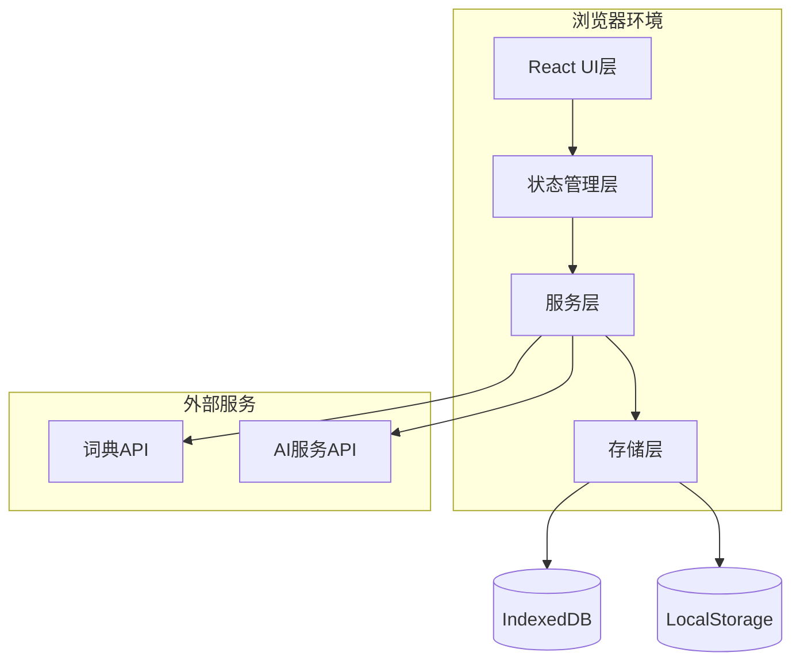
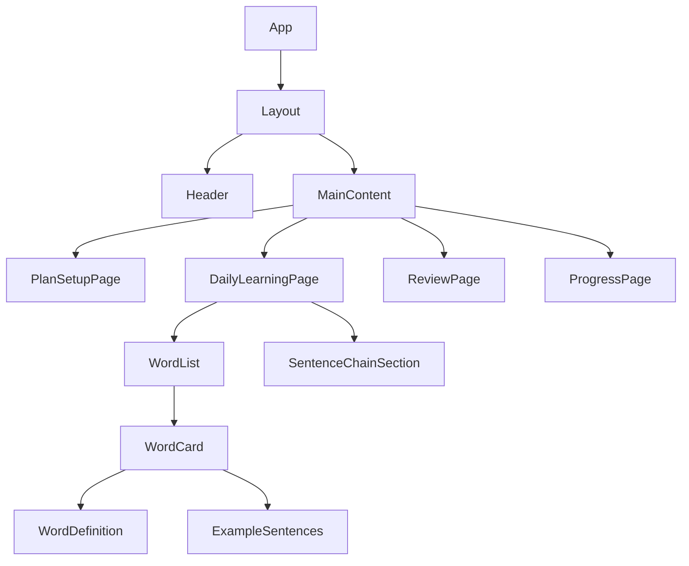
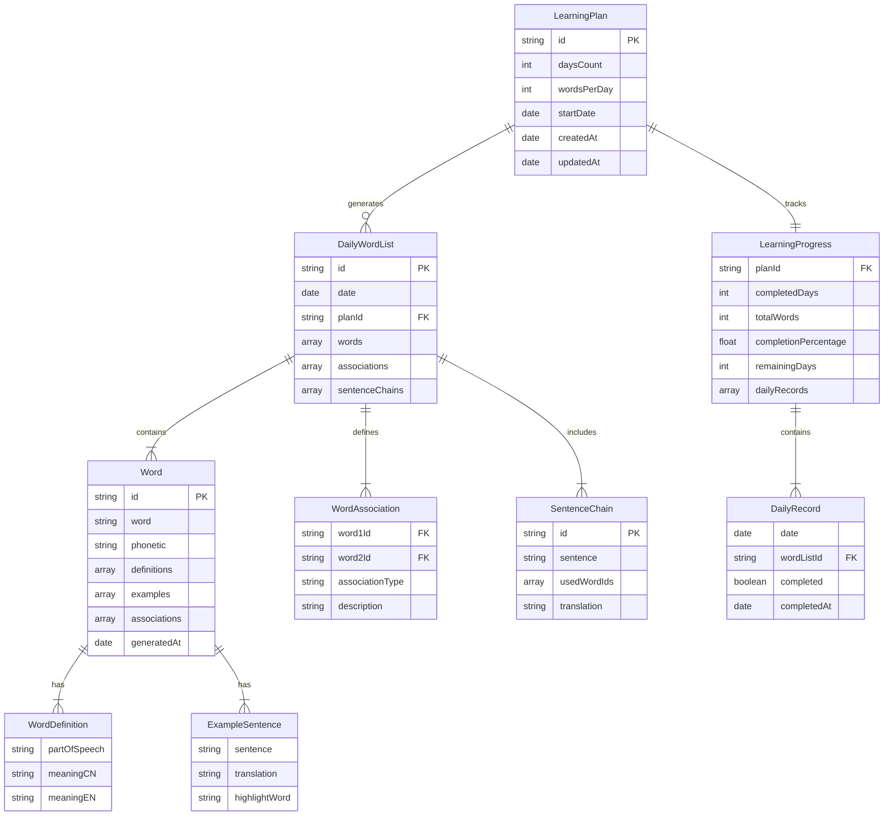

# 技术设计文档

## 概述

本文档描述了单词学习Web应用（Vocabulary Learning App）的技术设计。该应用是一个纯前端Web应用，使用现代Web技术栈构建，通过集成第三方API和AI服务实现智能单词学习功能。

### 设计目标

- **用户友好**：提供直观、响应式的用户界面
- **智能化**：利用AI技术生成关联单词和例句
- **离线优先**：支持数据本地持久化，减少网络依赖
- **可扩展**：模块化架构，便于功能扩展
- **性能优化**：快速加载和流畅的用户体验

## 架构

### 系统架构

本应用采用**单页应用（SPA）架构**，所有逻辑在浏览器端运行：



### 技术栈

**核心框架**：
- **React 18+**：UI组件库，提供声明式UI和高效渲染
- **TypeScript 5+**：类型安全的JavaScript超集
- **Vite**：快速的构建工具和开发服务器

**UI和样式**：
- **Tailwind CSS**：实用优先的CSS框架，实现响应式设计
- **Headless UI**：无样式的可访问组件库
- **Lucide React**：图标库

**状态管理**：
- **Zustand**：轻量级状态管理库，简单易用

**数据持久化**：
- **Dexie.js**：IndexedDB的现代包装器
- **LocalStorage API**：存储简单配置

**外部服务集成**：
- **Free Dictionary API**：免费词典服务（备选）
- **OpenAI API / Anthropic Claude API**：AI生成服务

**开发工具**：
- **ESLint + Prettier**：代码质量和格式化
- **Vitest**：单元测试框架
- **React Testing Library**：组件测试

## 组件和接口

### 组件层次结构



### 核心组件设计

#### 1. App组件
- **职责**：应用根组件，初始化全局状态和路由
- **状态**：无
- **子组件**：Layout

#### 2. Layout组件
- **职责**：应用布局容器，包含导航和主内容区
- **Props**：children
- **子组件**：Header, MainContent

#### 3. PlanSetupPage组件
- **职责**：学习计划创建和修改界面
- **状态**：表单输入状态（学习天数、每日单词数）
- **交互**：创建/更新学习计划

#### 4. DailyLearningPage组件
- **职责**：每日学习主界面
- **状态**：当前日期、单词列表、学习进度
- **子组件**：WordList, SentenceChainSection

#### 5. WordCard组件
- **职责**：展示单个单词的完整信息
- **Props**：word对象
- **子组件**：WordDefinition, ExampleSentences

#### 6. ReviewPage组件
- **职责**：历史单词复习界面
- **状态**：筛选条件、搜索关键词
- **功能**：按日期筛选、搜索单词

#### 7. ProgressPage组件
- **职责**：学习进度展示
- **状态**：学习统计数据
- **展示**：总单词数、完成百分比、剩余天数

### 服务层接口

#### LearningPlanService

```typescript
interface LearningPlan {
  id: string;
  daysCount: number;        // 1-365
  wordsPerDay: number;      // 1-100
  startDate: Date;
  createdAt: Date;
  updatedAt: Date;
}

interface LearningPlanService {
  createPlan(daysCount: number, wordsPerDay: number): Promise<LearningPlan>;
  updatePlan(id: string, updates: Partial<LearningPlan>): Promise<LearningPlan>;
  getCurrentPlan(): Promise<LearningPlan | null>;
  deletePlan(id: string): Promise<void>;
}
```

#### WordGeneratorService

```typescript
interface Word {
  id: string;
  word: string;
  phonetic?: string;
  definitions: WordDefinition[];
  examples: ExampleSentence[];
  associations: string[];    // 关联的单词ID
  generatedAt: Date;
}

interface WordDefinition {
  partOfSpeech: string;      // 词性
  meaningCN: string;         // 中文释义
  meaningEN: string;         // 英文释义
}

interface ExampleSentence {
  sentence: string;
  translation: string;
  highlightWord: string;
}

interface WordAssociation {
  word1Id: string;
  word2Id: string;
  associationType: 'theme' | 'semantic' | 'root' | 'context';
  description: string;
}

interface SentenceChain {
  id: string;
  sentence: string;
  usedWordIds: string[];
  translation: string;
}

interface DailyWordList {
  id: string;
  date: Date;
  planId: string;
  words: Word[];
  associations: WordAssociation[];
  sentenceChains: SentenceChain[];
}

interface WordGeneratorService {
  generateDailyWords(planId: string, date: Date, count: number): Promise<DailyWordList>;
  validateAssociations(words: Word[]): Promise<boolean>;
  generateSentenceChains(words: Word[]): Promise<SentenceChain[]>;
  getUsedWords(planId: string): Promise<string[]>;
}
```

#### DictionaryService

```typescript
interface DictionaryService {
  getWordDefinitions(word: string): Promise<WordDefinition[]>;
  getPhonetic(word: string): Promise<string | undefined>;
  searchWord(query: string): Promise<Word[]>;
}
```

#### ExampleSentenceService

```typescript
interface ExampleSentenceService {
  getExamples(word: string, count: number): Promise<ExampleSentence[]>;
  validateExamples(examples: ExampleSentence[]): boolean;
}
```

#### ProgressService

```typescript
interface LearningProgress {
  planId: string;
  completedDays: number;
  totalWords: number;
  completionPercentage: number;
  remainingDays: number;
  dailyRecords: DailyRecord[];
}

interface DailyRecord {
  date: Date;
  wordListId: string;
  completed: boolean;
  completedAt?: Date;
}

interface ProgressService {
  getProgress(planId: string): Promise<LearningProgress>;
  markDayComplete(planId: string, date: Date): Promise<void>;
  getDailyRecord(planId: string, date: Date): Promise<DailyRecord | null>;
}
```

#### StorageService

```typescript
interface StorageService {
  // Learning Plan
  savePlan(plan: LearningPlan): Promise<void>;
  loadPlan(id: string): Promise<LearningPlan | null>;
  loadCurrentPlan(): Promise<LearningPlan | null>;
  
  // Daily Word Lists
  saveDailyWordList(wordList: DailyWordList): Promise<void>;
  loadDailyWordList(date: Date): Promise<DailyWordList | null>;
  loadAllWordLists(planId: string): Promise<DailyWordList[]>;
  
  // Progress
  saveProgress(progress: LearningProgress): Promise<void>;
  loadProgress(planId: string): Promise<LearningProgress | null>;
  
  // History
  searchWords(query: string): Promise<Word[]>;
  getWordsByDateRange(startDate: Date, endDate: Date): Promise<Word[]>;
}
```

## 数据模型

### 实体关系图



### IndexedDB数据库模式

**数据库名称**：`VocabularyLearningDB`

**版本**：1

**对象存储（Object Stores）**：

1. **learningPlans**
   - keyPath: `id`
   - 索引：`startDate`

2. **dailyWordLists**
   - keyPath: `id`
   - 索引：`date`, `planId`

3. **words**
   - keyPath: `id`
   - 索引：`word`, `generatedAt`

4. **learningProgress**
   - keyPath: `planId`

### LocalStorage数据

- `currentPlanId`: 当前活动的学习计划ID
- `appSettings`: 应用设置（主题、语言等）

## 正确性属性

*属性是一个特征或行为，应该在系统的所有有效执行中保持为真——本质上是关于系统应该做什么的正式陈述。属性作为人类可读规范和机器可验证正确性保证之间的桥梁。*

### Property 1: 学习天数范围验证

*对于任何*输入的学习天数值，验证函数应该接受1到365之间的正整数，并拒绝该范围之外的所有值。

**验证需求：Requirements 1.4**

### Property 2: 每日单词数范围验证

*对于任何*输入的每日单词数值，验证函数应该接受1到100之间的正整数，并拒绝该范围之外的所有值。

**验证需求：Requirements 1.5**

### Property 3: 数据持久化往返一致性

*对于任何*有效的数据对象（学习计划、学习进度或每日单词列表），保存到存储后再读取应该返回等价的数据对象。

**验证需求：Requirements 1.6, 10.1, 10.2, 10.3, 10.4, 10.5**

### Property 4: 修改计划保留已完成进度

*对于任何*学习计划和已完成的学习进度，修改计划参数后，已完成天数的记录和已学习的单词数据应该保持不变。

**验证需求：Requirements 2.2**

### Property 5: 计划修改后未来安排重新计算

*对于任何*学习计划修改（改变天数或每日单词数），未来日期的学习安排应该根据新参数重新计算，而不是使用旧参数。

**验证需求：Requirements 2.3**

### Property 6: 每日单词列表数量匹配

*对于任何*学习计划和生成的每日单词列表，列表中的单词数量应该等于计划中设定的每日单词数。

**验证需求：Requirements 3.2**

### Property 7: 单词列表包含关联信息

*对于任何*生成的每日单词列表，应该包含单词之间的关联关系数据结构。

**验证需求：Requirements 3.3, 4.3**

### Property 8: 单词列表支持句子链构造

*对于任何*生成的每日单词列表，应该能够使用列表中的单词构造至少一个完整的句子链。

**验证需求：Requirements 3.4, 5.1**

### Property 9: 单词唯一性

*对于任何*新生成的每日单词列表，列表中的所有单词都不应该出现在该学习计划的历史单词列表中。

**验证需求：Requirements 3.5**

### Property 10: 单词关联度阈值

*对于任何*生成的每日单词列表，至少80%的单词对之间应该存在可识别的关联关系（主题、语义、词根或使用场景）。

**验证需求：Requirements 4.1**

### Property 11: 句子链数量要求

*对于任何*每日单词列表，应该生成至少3个使用列表中单词的句子链示例。

**验证需求：Requirements 5.2**

### Property 12: 词典数据完整性

*对于任何*查询的单词，词典服务返回的数据应该包含至少一个词性、每个词性的中英文释义，以及音标信息（如果可用）。

**验证需求：Requirements 6.1, 6.2, 6.3, 6.6**

### Property 13: 多词性完整覆盖

*对于任何*具有多个词性的单词，词典服务应该返回所有词性的解释，而不是只返回部分词性。

**验证需求：Requirements 6.4**

### Property 14: 例句数量范围

*对于任何*单词，例句服务应该返回10到15个例句。

**验证需求：Requirements 7.1**

### Property 15: 例句词性覆盖

*对于任何*具有多个主要词性的单词，返回的例句应该覆盖这些主要词性的用法。

**验证需求：Requirements 7.2**

### Property 16: 例句包含翻译

*对于任何*例句，数据结构中应该包含对应的中文翻译字段。

**验证需求：Requirements 7.4**

### Property 17: 进度统计计算正确性

*对于任何*学习计划和学习历史，计算的统计数据应该满足：
- 总单词数 = Σ(每天完成的单词数)
- 完成百分比 = (已完成天数 / 总天数) × 100
- 剩余天数 = 总天数 - 已完成天数

**验证需求：Requirements 8.2, 8.3, 8.4**

### Property 18: 完成任务更新进度

*对于任何*学习任务完成操作，执行后读取的进度数据应该反映该任务已完成（已完成天数增加，完成时间被记录）。

**验证需求：Requirements 8.5**

### Property 19: 日期筛选正确性

*对于任何*日期范围筛选，返回的所有单词的生成日期都应该在指定的日期范围内。

**验证需求：Requirements 9.2**

### Property 20: 历史单词数据完整性

*对于任何*历史单词，应该能够获取其完整的词典解释和例句信息，与首次生成时的数据等价。

**验证需求：Requirements 9.3**

### Property 21: 搜索结果相关性

*对于任何*搜索关键词，返回的所有单词都应该包含该关键词（不区分大小写）。

**验证需求：Requirements 9.4**

### Property 22: 错误日志记录

*对于任何*系统错误（词典服务失败、例句服务失败、单词生成失败、存储失败），都应该被记录到错误日志中。

**验证需求：Requirements 12.5**


## 错误处理

### 错误类型和处理策略

#### 1. 网络错误

**场景**：
- 词典API请求失败
- AI服务API请求超时
- 网络连接中断

**处理策略**：
- 显示用户友好的错误消息
- 提供重试按钮
- 对于词典查询，提供降级方案（使用缓存数据或备用API）
- 记录错误日志，包含时间戳、错误类型、请求参数

**用户体验**：
```
❌ 无法获取单词解释
网络连接出现问题，请检查您的网络设置。
[重试] [使用离线数据]
```

#### 2. 数据验证错误

**场景**：
- 用户输入无效的学习天数（<1 或 >365）
- 用户输入无效的每日单词数（<1 或 >100）
- 表单字段为空

**处理策略**：
- 实时表单验证，在用户输入时提供即时反馈
- 显示具体的验证错误消息
- 阻止提交无效数据
- 高亮显示错误字段

**用户体验**：
```
学习天数: [400] ❌
请输入1到365之间的数字

每日单词数: [0] ❌
请输入1到100之间的数字
```

#### 3. 存储错误

**场景**：
- IndexedDB存储空间不足
- 浏览器禁用了本地存储
- 数据写入失败

**处理策略**：
- 检测存储可用性，在应用启动时进行验证
- 提供清理旧数据的选项
- 显示存储使用情况
- 提供数据导出功能作为备份
- 记录详细的错误信息

**用户体验**：
```
⚠️ 存储空间不足
您的浏览器存储空间已满。请清理一些旧数据或导出数据后重试。
[查看存储使用情况] [清理旧数据] [导出数据]
```

#### 4. 单词生成错误

**场景**：
- AI服务返回无效数据
- 无法生成满足关联性要求的单词组合
- 单词库耗尽（所有单词都已使用）

**处理策略**：
- 验证AI返回的数据格式和内容
- 实现重试机制（最多3次）
- 提供手动选择单词的降级方案
- 记录生成失败的详细信息

**用户体验**：
```
❌ 单词生成失败
系统无法生成今天的单词列表。
[重新生成] [手动选择单词] [查看详情]
```

#### 5. 数据不一致错误

**场景**：
- 学习计划被删除但进度数据仍存在
- 单词列表引用了不存在的计划ID
- 数据版本不兼容

**处理策略**：
- 实现数据完整性检查
- 提供数据修复工具
- 在应用启动时进行数据验证
- 提供重置选项作为最后手段

**用户体验**：
```
⚠️ 数据不一致
检测到数据完整性问题。
[自动修复] [查看详情] [重置应用数据]
```

### 错误日志系统

**日志结构**：
```typescript
interface ErrorLog {
  id: string;
  timestamp: Date;
  errorType: 'network' | 'validation' | 'storage' | 'generation' | 'data_integrity';
  severity: 'low' | 'medium' | 'high' | 'critical';
  message: string;
  stack?: string;
  context: {
    userId?: string;
    planId?: string;
    action: string;
    additionalData?: Record<string, any>;
  };
}
```

**日志存储**：
- 使用IndexedDB存储错误日志
- 保留最近100条日志
- 提供日志导出功能供调试使用

**日志级别**：
- **Low**：不影响核心功能的小问题（如UI渲染警告）
- **Medium**：影响部分功能但有降级方案（如API请求失败但有缓存）
- **High**：影响核心功能（如无法保存数据）
- **Critical**：应用无法正常运行（如存储完全不可用）

## 测试策略

### 测试方法概述

本应用采用**双重测试方法**：
- **单元测试**：验证特定示例、边界情况和错误条件
- **属性测试**：验证跨所有输入的通用属性

两种方法互补，共同确保全面覆盖：
- 单元测试捕获具体的bug
- 属性测试验证通用正确性

### 属性测试配置

**测试框架**：
- **fast-check**：JavaScript/TypeScript的属性测试库
- 集成到Vitest测试套件中

**配置要求**：
- 每个属性测试最少运行100次迭代（由于随机化）
- 每个属性测试必须引用其设计文档中的属性
- 标签格式：`Feature: vocabulary-learning-app, Property {number}: {property_text}`

**示例属性测试**：
```typescript
import fc from 'fast-check';
import { describe, it, expect } from 'vitest';

describe('Property 1: 学习天数范围验证', () => {
  it('应该接受1-365范围内的值，拒绝范围外的值', () => {
    // Feature: vocabulary-learning-app, Property 1: 学习天数范围验证
    fc.assert(
      fc.property(fc.integer(), (days) => {
        const result = validateDaysCount(days);
        if (days >= 1 && days <= 365) {
          expect(result.valid).toBe(true);
        } else {
          expect(result.valid).toBe(false);
        }
      }),
      { numRuns: 100 }
    );
  });
});

describe('Property 3: 数据持久化往返一致性', () => {
  it('保存后读取应该返回等价数据', async () => {
    // Feature: vocabulary-learning-app, Property 3: 数据持久化往返一致性
    fc.assert(
      fc.asyncProperty(
        fc.record({
          daysCount: fc.integer({ min: 1, max: 365 }),
          wordsPerDay: fc.integer({ min: 1, max: 100 }),
        }),
        async (planData) => {
          const plan = await createPlan(planData.daysCount, planData.wordsPerDay);
          const loaded = await loadPlan(plan.id);
          expect(loaded).toEqual(plan);
        }
      ),
      { numRuns: 100 }
    );
  });
});
```

### 单元测试策略

**测试范围**：
- 组件渲染和交互
- 服务层函数
- 数据验证逻辑
- 错误处理流程
- 边界条件

**单元测试平衡**：
- 避免编写过多单元测试——属性测试已经处理了大量输入覆盖
- 单元测试应该专注于：
  - 演示正确行为的具体示例
  - 组件之间的集成点
  - 边界情况和错误条件

**示例单元测试**：
```typescript
describe('PlanSetupPage', () => {
  it('应该显示创建计划表单', () => {
    // Requirement 1.1
    render(<PlanSetupPage />);
    expect(screen.getByLabelText('学习天数')).toBeInTheDocument();
    expect(screen.getByLabelText('每日单词数')).toBeInTheDocument();
  });

  it('应该在输入无效时显示错误消息', async () => {
    // Requirement 1.4, 1.5
    render(<PlanSetupPage />);
    const daysInput = screen.getByLabelText('学习天数');
    
    await userEvent.type(daysInput, '400');
    await userEvent.tab();
    
    expect(screen.getByText(/请输入1到365之间的数字/)).toBeInTheDocument();
  });
});

describe('WordGeneratorService', () => {
  it('应该在API失败时显示错误消息', async () => {
    // Requirement 12.3
    mockAIService.generateWords.mockRejectedValue(new Error('API Error'));
    
    const result = await generateDailyWords('plan-1', new Date(), 10);
    
    expect(result.error).toBeDefined();
    expect(result.error.message).toContain('无法生成单词');
  });
});
```

### 集成测试

**测试场景**：
- 完整的用户流程（创建计划 → 学习单词 → 查看进度）
- 外部API集成（词典服务、AI服务）
- 数据持久化和恢复
- 跨浏览器兼容性

**工具**：
- **Playwright**：端到端测试
- **MSW (Mock Service Worker)**：模拟外部API

### 测试覆盖率目标

- **代码覆盖率**：>80%
- **属性测试覆盖**：所有22个正确性属性
- **单元测试覆盖**：所有核心服务和组件
- **集成测试覆盖**：主要用户流程

### 持续集成

**CI/CD流程**：
1. 代码提交触发CI
2. 运行ESLint和Prettier检查
3. 运行单元测试和属性测试
4. 运行集成测试
5. 生成测试覆盖率报告
6. 构建生产版本
7. 部署到测试环境

**测试执行时间优化**：
- 并行运行测试套件
- 使用测试缓存
- 属性测试在CI中运行更多迭代（200次）

## 实现细节

### 智能单词生成算法

**方法1：基于AI的生成（推荐）**

使用OpenAI或Claude API生成关联单词：

```typescript
async function generateDailyWords(
  planId: string,
  date: Date,
  count: number
): Promise<DailyWordList> {
  const usedWords = await getUsedWords(planId);
  
  const prompt = `
    生成${count}个英语单词，要求：
    1. 单词之间有主题或语义关联
    2. 不包含以下已使用的单词：${usedWords.join(', ')}
    3. 适合中级英语学习者
    4. 提供每个单词的词性、中英文释义、音标
    5. 提供10-15个例句（包含中文翻译）
    6. 说明单词之间的关联关系
    7. 生成3个使用这些单词的连锁造句
    
    返回JSON格式。
  `;
  
  const response = await aiService.generate(prompt);
  const wordData = parseAIResponse(response);
  
  // 验证关联性
  const associationRate = calculateAssociationRate(wordData.words);
  if (associationRate < 0.8) {
    throw new Error('生成的单词关联性不足');
  }
  
  return {
    id: generateId(),
    date,
    planId,
    words: wordData.words,
    associations: wordData.associations,
    sentenceChains: wordData.sentenceChains,
  };
}
```

**方法2：基于词向量的生成（备选）**

使用预训练的词向量模型（如Word2Vec）：

```typescript
async function generateRelatedWords(
  seedWord: string,
  count: number,
  usedWords: Set<string>
): Promise<string[]> {
  // 使用词向量找到语义相似的单词
  const similarWords = await wordVectorService.findSimilar(seedWord, count * 2);
  
  // 过滤已使用的单词
  const availableWords = similarWords.filter(w => !usedWords.has(w));
  
  // 返回前N个
  return availableWords.slice(0, count);
}
```

### 单词关联性验证

```typescript
function calculateAssociationRate(words: Word[]): number {
  const totalPairs = (words.length * (words.length - 1)) / 2;
  let associatedPairs = 0;
  
  for (let i = 0; i < words.length; i++) {
    for (let j = i + 1; j < words.length; j++) {
      if (hasAssociation(words[i], words[j])) {
        associatedPairs++;
      }
    }
  }
  
  return associatedPairs / totalPairs;
}

function hasAssociation(word1: Word, word2: Word): boolean {
  // 检查是否有显式的关联记录
  if (word1.associations.includes(word2.id)) {
    return true;
  }
  
  // 检查词根关联
  if (shareCommonRoot(word1.word, word2.word)) {
    return true;
  }
  
  // 检查语义相似度
  const similarity = calculateSemanticSimilarity(word1, word2);
  return similarity > 0.6;
}
```

### 数据持久化实现

**Dexie.js配置**：

```typescript
import Dexie, { Table } from 'dexie';

class VocabularyDB extends Dexie {
  learningPlans!: Table<LearningPlan>;
  dailyWordLists!: Table<DailyWordList>;
  words!: Table<Word>;
  learningProgress!: Table<LearningProgress>;

  constructor() {
    super('VocabularyLearningDB');
    
    this.version(1).stores({
      learningPlans: 'id, startDate',
      dailyWordLists: 'id, date, planId',
      words: 'id, word, generatedAt',
      learningProgress: 'planId',
    });
  }
}

export const db = new VocabularyDB();
```

**存储服务实现**：

```typescript
class StorageServiceImpl implements StorageService {
  async savePlan(plan: LearningPlan): Promise<void> {
    try {
      await db.learningPlans.put(plan);
      localStorage.setItem('currentPlanId', plan.id);
    } catch (error) {
      logger.error('Failed to save plan', { error, plan });
      throw new StorageError('无法保存学习计划');
    }
  }

  async loadCurrentPlan(): Promise<LearningPlan | null> {
    const currentPlanId = localStorage.getItem('currentPlanId');
    if (!currentPlanId) return null;
    
    return await db.learningPlans.get(currentPlanId) || null;
  }

  async searchWords(query: string): Promise<Word[]> {
    const lowerQuery = query.toLowerCase();
    return await db.words
      .filter(word => word.word.toLowerCase().includes(lowerQuery))
      .toArray();
  }
}
```

### 响应式设计实现

**Tailwind CSS断点**：
- `sm`: 640px（手机横屏）
- `md`: 768px（平板）
- `lg`: 1024px（桌面）
- `xl`: 1280px（大屏幕）

**响应式布局示例**：

```tsx
function WordCard({ word }: { word: Word }) {
  return (
    <div className="
      bg-white rounded-lg shadow-md p-4
      sm:p-6
      md:p-8
      lg:flex lg:gap-6
    ">
      <div className="lg:w-1/3">
        <h2 className="text-2xl font-bold mb-2">{word.word}</h2>
        <p className="text-gray-600">{word.phonetic}</p>
      </div>
      
      <div className="mt-4 lg:mt-0 lg:w-2/3">
        {word.definitions.map((def, index) => (
          <div key={index} className="mb-4">
            <span className="text-sm font-semibold text-blue-600">
              {def.partOfSpeech}
            </span>
            <p className="mt-1">{def.meaningCN}</p>
            <p className="text-sm text-gray-600">{def.meaningEN}</p>
          </div>
        ))}
      </div>
    </div>
  );
}
```

### 性能优化

**1. 代码分割**：
```typescript
// 路由级别的代码分割
const PlanSetupPage = lazy(() => import('./pages/PlanSetupPage'));
const DailyLearningPage = lazy(() => import('./pages/DailyLearningPage'));
const ReviewPage = lazy(() => import('./pages/ReviewPage'));
```

**2. 虚拟滚动**：
```typescript
// 对于长列表使用虚拟滚动
import { useVirtualizer } from '@tanstack/react-virtual';

function WordList({ words }: { words: Word[] }) {
  const parentRef = useRef<HTMLDivElement>(null);
  
  const virtualizer = useVirtualizer({
    count: words.length,
    getScrollElement: () => parentRef.current,
    estimateSize: () => 200,
  });
  
  return (
    <div ref={parentRef} className="h-screen overflow-auto">
      <div style={{ height: `${virtualizer.getTotalSize()}px` }}>
        {virtualizer.getVirtualItems().map((virtualItem) => (
          <div
            key={virtualItem.key}
            style={{
              position: 'absolute',
              top: 0,
              left: 0,
              width: '100%',
              transform: `translateY(${virtualItem.start}px)`,
            }}
          >
            <WordCard word={words[virtualItem.index]} />
          </div>
        ))}
      </div>
    </div>
  );
}
```

**3. 数据缓存**：
```typescript
// 使用React Query缓存API请求
import { useQuery } from '@tanstack/react-query';

function useDailyWords(date: Date) {
  return useQuery({
    queryKey: ['dailyWords', date.toISOString()],
    queryFn: () => loadDailyWordList(date),
    staleTime: 1000 * 60 * 60, // 1小时
    cacheTime: 1000 * 60 * 60 * 24, // 24小时
  });
}
```

**4. 图片和资源优化**：
- 使用WebP格式的图片
- 实现懒加载
- 压缩和最小化资源

## 部署

### 构建配置

**Vite配置**：
```typescript
// vite.config.ts
import { defineConfig } from 'vite';
import react from '@vitejs/plugin-react';

export default defineConfig({
  plugins: [react()],
  build: {
    target: 'es2015',
    minify: 'terser',
    sourcemap: true,
    rollupOptions: {
      output: {
        manualChunks: {
          'react-vendor': ['react', 'react-dom'],
          'ui-vendor': ['@headlessui/react', 'lucide-react'],
        },
      },
    },
  },
});
```

### 部署平台

**推荐平台**：
- **Vercel**：零配置部署，自动HTTPS，全球CDN
- **Netlify**：类似Vercel，提供表单处理和函数
- **GitHub Pages**：免费静态托管

**部署步骤（Vercel）**：
1. 连接GitHub仓库
2. 配置构建命令：`npm run build`
3. 配置输出目录：`dist`
4. 自动部署每次提交

### 环境变量

```bash
# .env.production
VITE_API_BASE_URL=https://api.example.com
VITE_OPENAI_API_KEY=sk-...
VITE_DICTIONARY_API_URL=https://api.dictionaryapi.dev/api/v2
```

### 监控和分析

**工具**：
- **Sentry**：错误追踪和性能监控
- **Google Analytics**：用户行为分析
- **Vercel Analytics**：Web Vitals监控

## 未来扩展

### 短期扩展（1-3个月）

1. **语音功能**：
   - 单词发音播放
   - 语音识别练习

2. **复习算法优化**：
   - 实现间隔重复算法（Spaced Repetition）
   - 根据用户掌握程度调整复习频率

3. **社交功能**：
   - 分享学习进度
   - 学习小组和挑战

### 中期扩展（3-6个月）

1. **多语言支持**：
   - 支持学习其他语言（西班牙语、法语等）
   - 界面多语言化

2. **离线模式**：
   - Service Worker实现完全离线功能
   - 离线词典数据包

3. **个性化推荐**：
   - 基于学习历史的智能推荐
   - 难度自适应调整

### 长期扩展（6-12个月）

1. **移动应用**：
   - React Native移动端
   - 与Web端数据同步

2. **AI对话练习**：
   - 与AI进行对话练习
   - 实时纠错和建议

3. **游戏化学习**：
   - 成就系统
   - 排行榜和竞赛

## 总结

本技术设计文档详细描述了单词学习Web应用的架构、组件、数据模型、正确性属性、错误处理和测试策略。该设计采用现代Web技术栈，注重用户体验、数据可靠性和系统可扩展性。

**关键设计决策**：
1. 纯前端SPA架构，降低部署复杂度
2. 使用AI服务生成智能关联单词
3. IndexedDB本地持久化，支持离线使用
4. 属性测试确保核心逻辑正确性
5. 响应式设计支持多设备访问

**下一步**：
- 创建任务分解文档
- 开始实现核心功能
- 建立CI/CD流程
